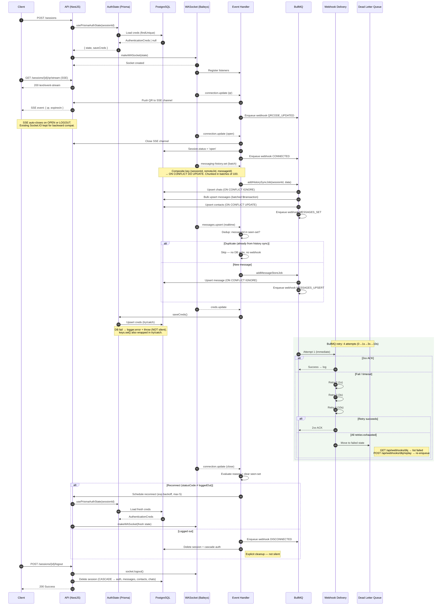

# PLAN.md — Baileys Server Architecture Upgrade

> **Version:** 2.0 · **Updated:** 2026-05-03
> **Scope:** Production-hardening. No new infra (Redis deferred to Phase 2).

---

## Architecture Overview



---

## Fix Inventory

### FIX 1 — SSE for QR Code Push

| | Detail |
|---|---|
| **Problem** | QR hanya via Socket.IO + webhook. Client butuh Socket.IO library. |
| **Solution** | `GET /sessions/{id}/qr/stream` → SSE (`text/event-stream`). Auto-close on OPEN/LOGOUT. |
| **Priority** | 🔵 Low — Socket.IO sudah works. SSE = UX improvement. |
| **Effort** | M |

**Checklist:**
- [ ] Add `@Sse()` endpoint di `session.controller.ts` returning `Observable<MessageEvent>`
- [ ] Subscribe to `EventEmitter2` events: `session.qr`, `session.connected`, `session.logged-out`
- [ ] On `connected` / `logged-out` → complete the Observable (closes SSE)
- [ ] Keep existing Socket.IO gateway (`session.gateway.ts`) untuk backward compat
- [ ] Test: SSE stream opens, receives QR, auto-closes on connection open

**Files:**
- `src/session/session.controller.ts` — add SSE endpoint
- `src/session/session.service.ts` — no changes needed (already emits events)

---

### FIX 2 — History Sync + Dedup Guard (⚠️ CRITICAL)

| | Detail |
|---|---|
| **Problem** | `messaging-history.set` event **not handled**. Historical messages lost. No dedup between history sync and realtime `messages.upsert`. |
| **Solution** | Handle `messaging-history.set`, batch upsert via BullMQ. In-memory `Set<string>` dedup guard for realtime events. |
| **Priority** | 🔴 Critical — data loss |
| **Effort** | M |

**Checklist:**
- [ ] Add `messaging-history.set` listener in `session.service.ts`
- [ ] Create `addHistorySyncJob()` in `queue.service.ts`
- [ ] Create `history-sync.processor.ts` — batch upsert messages, chats, contacts
- [ ] Chunk batch into groups of 100 to avoid transaction timeouts
- [ ] Add `HISTORY_SYNC` to `QUEUE_NAMES`
- [ ] Add in-memory `seenMessages: Set<string>` per session in `SessionData`
- [ ] On `messages.upsert` → skip if `messageId` already in `seenMessages`
- [ ] On `messaging-history.set` → populate `seenMessages` with processed message IDs
- [ ] On reconnect (`connection: 'close'`) → clear `seenMessages`
- [ ] Emit webhook `MESSAGES_SET` after history sync completes
- [ ] Test: connect → verify history messages stored → verify no duplicates on realtime

**Files:**
- `src/session/session.service.ts` — add `messaging-history.set` listener, add `seenMessages` to `SessionData`
- `src/queue/queue.service.ts` — add `addHistorySyncJob()`
- `src/queue/queue.constants.ts` — add `HISTORY_SYNC`
- `src/queue/processors/history-sync.processor.ts` — **new file**
- `src/queue/queue.module.ts` — register new queue + processor

---

### FIX 3 — Auth State Error Handling (⚠️ IMPORTANT)

| | Detail |
|---|---|
| **Problem** | `saveCreds()` (L35-42) dan `keys.set()` (L80-114) di `prisma-auth-state.ts` **tidak ada error handling**. DB failure = silent credential loss. |
| **Solution** | Wrap both in try/catch. `saveCreds` fail → `logger.error` + re-throw. `keys.set` fail → `logger.error` (don't crash socket). |
| **Priority** | 🟡 Medium — credential loss risk |
| **Effort** | S |

**Checklist:**
- [ ] Wrap `saveCreds` body in try/catch — log error, re-throw
- [ ] Wrap `keys.set` `$transaction` in try/catch — log error, **don't re-throw** (let socket continue)
- [ ] Add `Logger` parameter to `usePrismaAuthState()`
- [ ] In `session.service.ts` L278: wrap `creds.update` handler to catch thrown errors from saveCreds
- [ ] Test: simulate DB failure → verify error logged, verify socket doesn't crash

**Files:**
- `src/session/prisma-auth-state.ts` — add try/catch to `saveCreds` and `keys.set`
- `src/session/session.service.ts` — catch `saveCreds` errors in `creds.update` handler

---

### FIX 4 — Webhook DLQ + Replay Endpoint

| | Detail |
|---|---|
| **Problem** | Failed webhook jobs sit in BullMQ `failed` state. No visibility, no replay. |
| **Solution** | Custom retry delays (0→1s→3s→10s). DLQ replay endpoint. |
| **Priority** | 🟡 Medium — production observability |
| **Effort** | M |

**Checklist:**
- [ ] Update `addWebhookDeliveryJob()` backoff: `{ type: 'custom' }` with delay array `[0, 1000, 3000, 10000]`
- [ ] Implement custom backoff strategy in `queue.module.ts`
- [ ] Add `GET /api/webhooks/failed` — list failed jobs from BullMQ
- [ ] Add `POST /api/webhooks/failed/replay` — re-enqueue all failed jobs
- [ ] Add `POST /api/webhooks/failed/:jobId/replay` — re-enqueue single job
- [ ] Create `webhook.controller.ts` + `webhook.module.ts` (currently empty dir!)
- [ ] Test: webhook to unreachable URL → verify 4 attempts → verify shows in failed list → replay works

**Files:**
- `src/webhook/webhook.controller.ts` — **new file**
- `src/webhook/webhook.module.ts` — **new file**
- `src/queue/queue.service.ts` — update backoff config, add `getFailedWebhookJobs()`, `replayWebhookJob()`
- `src/queue/queue.module.ts` — register custom backoff

---

### FIX 5 — Reconnect Robustness

| | Detail |
|---|---|
| **Problem** | Reconnect logic already correct (loads fresh creds from DB). But: no backpressure on mass-reconnect after server restart. |
| **Solution** | Stagger auto-reconnect with delay. Add jitter to prevent thundering herd. |
| **Priority** | 🔵 Low — only matters at scale (50+ sessions) |
| **Effort** | S |

**Checklist:**
- [ ] In `autoReconnectSessions()`: add staggered delay (e.g., 500ms × index + random jitter)
- [ ] Log reconnect progress: `Reconnecting session 3/47...`
- [ ] Test: restart server with 10 open sessions → verify staggered reconnect

**Files:**
- `src/session/session.service.ts` — modify `autoReconnectSessions()`

---

## Priority Matrix

| Fix | Impact | Urgency | Effort | Phase |
|-----|--------|---------|--------|-------|
| **FIX 2** — History sync + dedup | 🔴 Critical | 🔴 Now | M | **Phase 1** |
| **FIX 3** — Auth error handling | 🟡 High | 🟡 Soon | S | **Phase 1** |
| **FIX 4** — Webhook DLQ + replay | 🟡 Medium | 🟡 Soon | M | **Phase 1** |
| **FIX 1** — SSE for QR | 🔵 Low | 🔵 Later | M | **Phase 2** |
| **FIX 5** — Reconnect stagger | 🔵 Low | 🔵 Later | S | **Phase 2** |

---

## Implementation Order

### Phase 1 — Production Hardening (target: this sprint)

```
1. FIX 3 → saveCreds + keys.set error handling     (S, ~30min)
2. FIX 2 → messaging-history.set + dedup guard      (M, ~3hr)
3. FIX 4 → webhook DLQ + replay endpoints           (M, ~2hr)
```

### Phase 2 — UX & Scale (next sprint)

```
4. FIX 1 → SSE endpoint for QR                      (M, ~1hr)
5. FIX 5 → reconnect stagger + jitter               (S, ~30min)
```

### Phase 3 — Redis Cache Layer (deferred)

> **Not in scope for v1.** Redis caching for auth state is a performance optimization, not a correctness fix. Introduce only when managing 50+ concurrent sessions.
>
> When ready:
> - Add Redis module (`@nestjs/cache-manager` or `ioredis`)
> - `saveCreds` → write Redis (fast) + write DB (persistent)
> - `loadCreds` → read Redis first, fallback to DB
> - `keys.get/set` → optional Redis cache layer

---

## Testing Strategy

| Fix | Test Type | What to verify |
|-----|-----------|----------------|
| FIX 2 | Integration | Connect → history sync fires → messages in DB → no duplicates on realtime upsert |
| FIX 3 | Unit | Mock Prisma to throw → verify logger.error called → verify socket not crashed |
| FIX 4 | Integration | Send webhook to `http://localhost:1` (unreachable) → verify 4 retries → verify in failed list → replay |
| FIX 1 | E2E | Open SSE stream → scan QR → verify events → verify stream closes on connect |
| FIX 5 | Integration | Seed 5 sessions as 'open' → restart → verify staggered timing in logs |

---

## What Was Removed (vs v1 plan)

| Item | Reason |
|------|--------|
| Redis as auth cache | No Redis in project yet. Correctness > performance. Deferred to Phase 3. |
| `AuthState Provider` participant | Doesn't exist in code. Plan described aspirational abstraction. |
| `DEGRADED` status + `fireInitQueries` retry | `fireInitQueries` is internal Baileys — can't wrap. Rare edge case. |
| Auto-drain DLQ | Over-engineering. Manual replay endpoint sufficient for v1. |
| Auto-hard-delete on Baileys `loggedOut` event | Changed to soft-delete (`status = 'logged_out'`) to protect against spurious disconnect signals from WhatsApp Web causing catastrophic data loss (cascaded delete). Hard deletion is now strictly reserved for explicit user-initiated `DELETE /sessions/{id}` or `POST /sessions/{id}/logout` calls. |