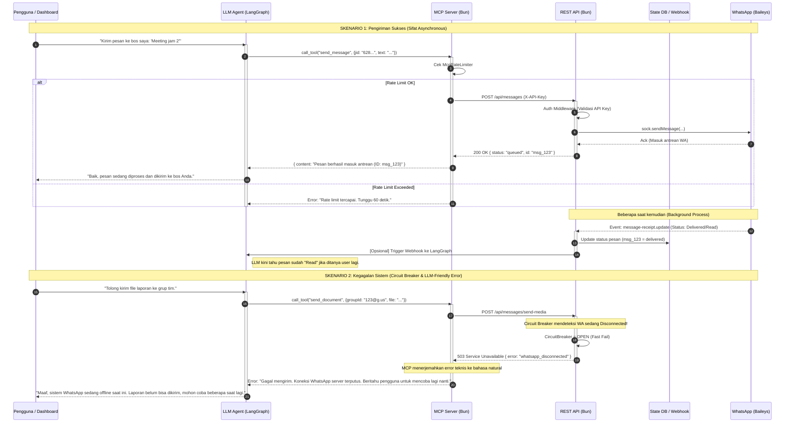

# System Architecture

## Overview

This document describes the system architecture for asynchronous message handling and resilience patterns. For the MCP proxy architecture, see [MCP Architecture](MCP_ARCHITECTURE.md).

## Architecture Diagram

Full Mermaid sequence diagram.



## Key Flows

### Scenario 1: Successful Message Send (Async Status)

```
User → LLM Agent → MCP.call_tool("send_text_message")
                         │
                    MCP Rate Limiter (Layer 2)
                         │
                    MCP → REST: POST /v1/messages/send
                         │
                    REST Auth Middleware + Rate Limiter (Layer 1)
                         │
                    REST → Circuit Breaker → Baileys.sendMessage()
                         │
                    WhatsApp ← Message Sent
                         │
                    REST → MCP: 201 { status: "queued", id: "msg_123" }
                         │
                    MCP → LLM: "Message queued (ID: msg_123)"
                         │
                    LLM → User: "Done! Your message has been sent."

                    ... async (seconds to minutes later) ...

                    WhatsApp → EventBus: "message.status" { delivered }
                         │
                    MessageStatusService → DB: UPDATE sent_messages
                                               SET status='delivered'
                         │
                    WebhookService → External webhook with status update
```

### Scenario 2: Circuit Breaker Fast-Fail

```
User → LLM Agent → MCP.call_tool("send_document")
                         │
                    MCP → REST: POST /v1/messages/send-media
                         │
                    REST → Circuit Breaker → OPEN! (WhatsApp disconnected)
                         │
                    REST → MCP: 503 { error: "WHATSAPP_DISCONNECTED" }
                         │
                    MCP → translateErrorForLLM()
                         │
                    MCP → LLM: "Failed to send. The WhatsApp connection
                                is currently down. Please inform the
                                user to try again later."
                         │
                    LLM → User: "Sorry, WhatsApp is temporarily offline.
                                 Please try again in a few minutes."
```

## Circuit Breaker

The circuit breaker protects message routes from cascading failures when WhatsApp is disconnected.

### States

```
                    ┌─────────────────────┐
                    │      CLOSED         │
                    │ (Normal operation)  │
                    └──────────┬──────────┘
                               │ 5 consecutive failures
                    ┌──────────▼──────────┐
                    │       OPEN          │
                    │ (Fast-fail 503)     │
                    └──────────┬──────────┘
                               │ 60s timeout
                    ┌──────────▼──────────┐
                    │     HALF_OPEN       │
                    │ (Test 1 request)    │
                    └──────────┬──────────┘
                          ┌────┴────┐
                       success   failure
                          │         │
                    ┌─────▼───┐ ┌───▼─────┐
                    │ CLOSED  │ │  OPEN   │
                    └─────────┘ └─────────┘
```

### Configuration (defaults)

| Parameter | Value | Description |
|-----------|-------|-------------|
| `failureThreshold` | 5 | Failures before opening |
| `resetTimeout` | 60000ms | Time before testing recovery |
| `halfOpenMax` | 1 | Max requests in half-open state |

### Auto-Reset on Reconnect

When a WhatsApp connection opens (`connection.open` event), the circuit breaker is immediately reset to `CLOSED` state — no need to wait for the 60s timeout.

## Message Status Tracking

### Database Table: `sent_messages`

| Column | Type | Description |
|--------|------|-------------|
| `id` | text (PK) | WhatsApp message ID |
| `session_id` | text | Session that sent the message |
| `to` | text | Recipient JID |
| `type` | text | Message type (text, image, video, audio, document) |
| `status` | text | Current status: `queued` → `sent` → `delivered` → `read` |
| `status_updated_at` | timestamp | Last status transition time |
| `created_at` | timestamp | When the message was first tracked |

### Status Lifecycle

```
   queued ──→ sent ──→ delivered ──→ read
     │                                │
     └── Only forward transitions ────┘
         (no status regression)
```

Status updates are **idempotent and forward-only**. A message at `delivered` cannot go back to `sent`.

### Event Flow

```
1. REST sends message → EventBus emits "message.sent"
2. MessageStatusListener catches event → MessageStatusService.trackSent()
3. DB INSERT: { id: "msg_123", status: "queued" }

... WhatsApp processes delivery ...

4. WhatsApp receipt → EventBus emits "message.status" { status: "delivered" }
5. MessageStatusListener catches event → MessageStatusService.updateStatus()
6. DB UPDATE: SET status = 'delivered', status_updated_at = NOW()
```

## LLM Error Translation

The MCP layer translates technical error codes into natural-language messages for LLM agents:

| Error Code | Natural Language Message |
|------------|------------------------|
| `WHATSAPP_DISCONNECTED` | Failed to send. The WhatsApp connection is currently down. Please inform the user to try again later. |
| `SESSION_NOT_FOUND` | WhatsApp session not found. Make sure the session has been created and is active. |
| `SESSION_NOT_CONNECTED` | WhatsApp session is not connected yet. Ask the user to scan the QR code first. |
| `RATE_LIMITED` | Rate limit reached. Please wait a moment before trying again. |
| `TIMEOUT` | The request timed out. The WhatsApp server may be slow — please try again. |
| `CONNECTION_ERROR` | Could not reach the WhatsApp server. Please check the service status and try again. |
| `VALIDATION_ERROR` | Invalid request: [original error message] |

Unknown error codes receive a generic message: `"An error occurred: [message]. Please try again or contact support."`

## Component Map

```
src/
├── adapters/
│   ├── rest/routes/messages.ts    ← Circuit breaker + queued response
│   └── mcp/api-client.ts         ← Error translation (translateErrorForLLM)
│
├── core/
│   ├── baileys/baileys.service.ts ← CB reset on connection.open
│   └── messaging/
│       ├── message-status.service.ts  ← DB persistence (CRUD)
│       └── message-status.listener.ts ← EventBus → Service bridge
│
└── infrastructure/
    ├── database/schema.ts         ← sent_messages table
    ├── resilience/circuit-breaker.ts ← Circuit breaker implementation
    └── events.ts                  ← Typed event bus
```
