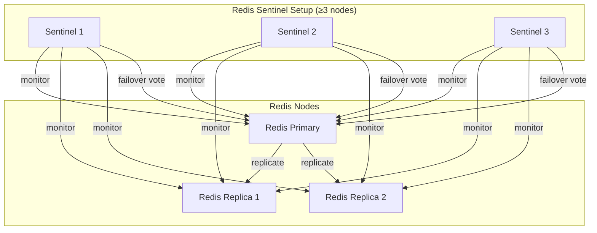
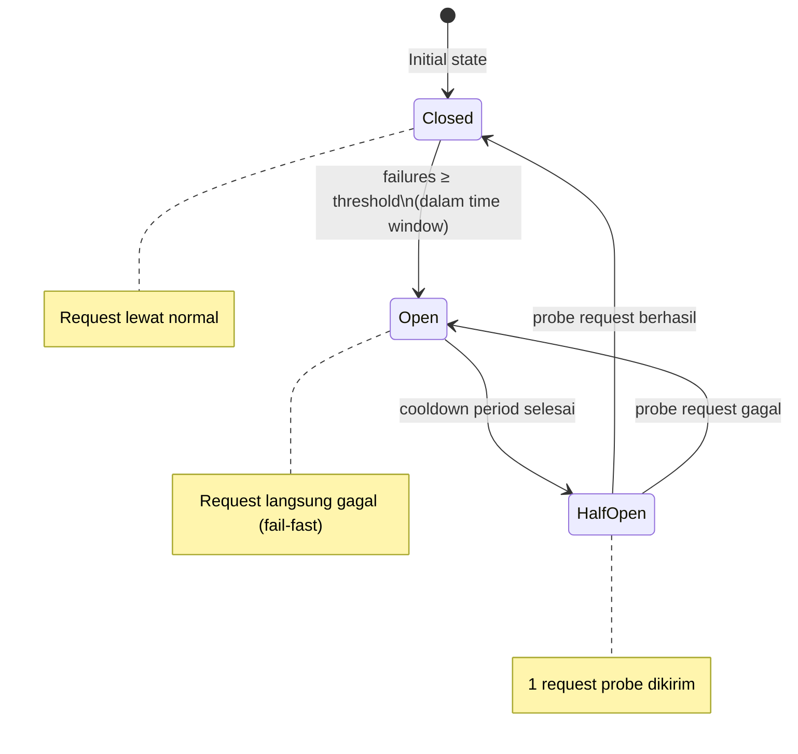
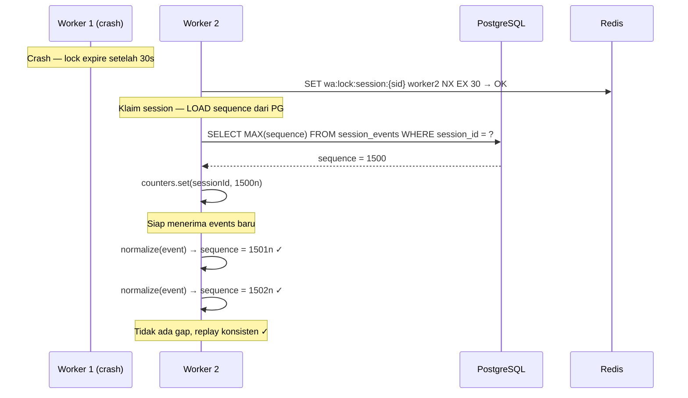

# WhatsApp API Platform — Architecture Improvements (Supplement)

> Dokumen ini merupakan suplemen dari Architecture Blueprint Part 1–4.
> Berisi perbaikan konkret atas 5 isu yang ditemukan pada review arsitektur.

---

## Daftar Perbaikan

| # | Isu | Prioritas |
|---|-----|-----------|
| Fix 1 | Redis Single Point of Failure → HA dengan Sentinel | 🔴 Kritis |
| Fix 2 | RPC Timeout & Circuit Breaker pada Worker ↔ Worker | 🔴 Kritis |
| Fix 3 | Prisma Middleware — semua action verb dicakup | 🟡 Penting |
| Fix 4 | Event Store Sequence Counter saat Failover | 🟡 Penting |
| Fix 5 | Rate Limiting per-Nomor mengikuti pola WhatsApp | 🟡 Penting |

---

## Fix 1: Redis High Availability (Sentinel)

### Masalah

Seluruh sistem bergantung pada Redis untuk: distributed locks, pub/sub, BullMQ, rate limiting, idempotency cache, dan session registry. Satu Redis instance yang mati = seluruh platform berhenti.

### Solusi: Redis Sentinel (per topology)



**Behavior saat Primary mati:**
1. Sentinel mendeteksi Primary down (dalam `down-after-milliseconds`, default 5s)
2. Minimal `quorum` Sentinel setuju → mulai failover
3. Replica terpilih dipromosikan jadi Primary baru
4. Sentinel memberitahu semua client via `CLIENT UNPAUSE`
5. Koneksi otomatis di-reconnect ke Primary baru

### Konfigurasi: `sentinel.conf`

```conf
# sentinel.conf
sentinel monitor mymaster 127.0.0.1 6379 2   # quorum = 2 dari 3 sentinel
sentinel down-after-milliseconds mymaster 5000
sentinel failover-timeout mymaster 60000
sentinel parallel-syncs mymaster 1
```

### Docker Compose (Topology Medium) — Update

```yaml
# docker-compose.yml — tambahkan Redis HA
services:
  redis-primary:
    image: redis:7-alpine
    command: redis-server --appendonly yes --replica-lazy-flush yes
    volumes:
      - redis_primary_data:/data
    healthcheck:
      test: ["CMD", "redis-cli", "ping"]
      interval: 5s
      timeout: 3s
      retries: 5

  redis-replica-1:
    image: redis:7-alpine
    command: redis-server --replicaof redis-primary 6379 --appendonly yes
    depends_on:
      redis-primary:
        condition: service_healthy

  redis-replica-2:
    image: redis:7-alpine
    command: redis-server --replicaof redis-primary 6379 --appendonly yes
    depends_on:
      redis-primary:
        condition: service_healthy

  redis-sentinel-1:
    image: redis:7-alpine
    command: redis-sentinel /etc/sentinel.conf
    volumes:
      - ./config/sentinel.conf:/etc/sentinel.conf
    depends_on:
      - redis-primary
      - redis-replica-1
      - redis-replica-2

  redis-sentinel-2:
    image: redis:7-alpine
    command: redis-sentinel /etc/sentinel.conf
    volumes:
      - ./config/sentinel.conf:/etc/sentinel.conf

  redis-sentinel-3:
    image: redis:7-alpine
    command: redis-sentinel /etc/sentinel.conf
    volumes:
      - ./config/sentinel.conf:/etc/sentinel.conf
```

### Redis Module — Update untuk Sentinel

```typescript
// redis/redis.module.ts

import { Module } from '@nestjs/common';
import Redis, { Cluster } from 'ioredis';
import { ConfigService } from '@nestjs/config';

export const REDIS_CLIENT = 'REDIS_CLIENT';
export const REDIS_SUB_CLIENT = 'REDIS_SUB_CLIENT';

function createRedisClient(config: ConfigService): Redis {
  const mode = config.get<string>('REDIS_MODE', 'standalone'); // standalone | sentinel | cluster

  if (mode === 'sentinel') {
    return new Redis({
      sentinels: config.get<string>('REDIS_SENTINELS')
        .split(',')
        .map(s => {
          const [host, port] = s.split(':');
          return { host, port: Number(port) };
        }),
      name: config.get<string>('REDIS_SENTINEL_MASTER', 'mymaster'),
      password: config.get<string>('REDIS_PASSWORD'),
      sentinelPassword: config.get<string>('REDIS_SENTINEL_PASSWORD'),
      // Reconnect otomatis saat failover
      reconnectOnError: (err) => {
        const targetErrors = ['READONLY', 'ECONNREFUSED', 'ECONNRESET'];
        return targetErrors.some(e => err.message.includes(e));
      },
      retryStrategy: (times) => Math.min(times * 100, 3000),
      maxRetriesPerRequest: 3,
      enableReadyCheck: true,
      lazyConnect: false,
    });
  }

  if (mode === 'cluster') {
    // Untuk scale horizontal Redis
    return new Cluster(
      config.get<string>('REDIS_CLUSTER_NODES')
        .split(',')
        .map(n => {
          const [host, port] = n.split(':');
          return { host, port: Number(port) };
        }),
      {
        redisOptions: { password: config.get('REDIS_PASSWORD') },
        scaleReads: 'slave', // baca dari replica
      }
    ) as unknown as Redis;
  }

  // Default: standalone (dev/single-node)
  return new Redis({
    host: config.get('REDIS_HOST', 'localhost'),
    port: config.get<number>('REDIS_PORT', 6379),
    password: config.get('REDIS_PASSWORD'),
    retryStrategy: (times) => Math.min(times * 100, 3000),
    maxRetriesPerRequest: 3,
  });
}

@Module({
  providers: [
    {
      provide: REDIS_CLIENT,
      inject: [ConfigService],
      useFactory: (config: ConfigService) => createRedisClient(config),
    },
    {
      provide: REDIS_SUB_CLIENT,
      inject: [ConfigService],
      useFactory: (config: ConfigService) => createRedisClient(config), // instance terpisah untuk subscribe
    },
  ],
  exports: [REDIS_CLIENT, REDIS_SUB_CLIENT],
})
export class RedisModule {}
```

### Environment Variables — Update

```env
# Standalone (dev)
REDIS_MODE=standalone
REDIS_HOST=localhost
REDIS_PORT=6379

# Sentinel (production)
REDIS_MODE=sentinel
REDIS_SENTINELS=sentinel1:26379,sentinel2:26379,sentinel3:26379
REDIS_SENTINEL_MASTER=mymaster
REDIS_SENTINEL_PASSWORD=sentinel_secret
REDIS_PASSWORD=redis_secret

# Cluster (large scale)
REDIS_MODE=cluster
REDIS_CLUSTER_NODES=node1:7000,node2:7001,node3:7002
```

---

## Fix 2: RPC Timeout & Circuit Breaker

### Masalah

Queue Worker mengirim RPC ke Session Worker via Redis pub/sub, lalu menunggu response. Jika Session Worker lambat atau crash mid-operation, Queue Worker akan hang tanpa batas waktu. Ini bisa menyebabkan job menumpuk dan platform freeze.

### Solusi: RPC dengan Timeout + Circuit Breaker



### Implementasi: `rpc-client.service.ts`

```typescript
// common/rpc/rpc-client.service.ts

import { Injectable, Logger } from '@nestjs/common';
import { Inject } from '@nestjs/common';
import { REDIS_CLIENT, REDIS_SUB_CLIENT } from '../../redis/redis.module';
import Redis from 'ioredis';
import { v4 as uuid } from 'uuid';

// ─── Circuit Breaker State ────────────────────────────────────────────────────

interface CircuitBreakerState {
  status: 'closed' | 'open' | 'half-open';
  failures: number;
  lastFailureAt: number | null;
  lastSuccessAt: number | null;
}

interface RpcOptions {
  timeoutMs?: number;        // default: 5000ms
  retries?: number;          // default: 2
  retryDelayMs?: number;     // default: 500ms
}

// ─── RPC Result ───────────────────────────────────────────────────────────────

type RpcResult<T> =
  | { ok: true; data: T }
  | { ok: false; error: 'TIMEOUT' | 'CIRCUIT_OPEN' | 'WORKER_ERROR' | 'NO_OWNER'; message: string };

// ─── Config ───────────────────────────────────────────────────────────────────

const CB_CONFIG = {
  failureThreshold: 5,       // buka circuit setelah 5 gagal dalam window
  windowMs: 60_000,          // 1 menit
  cooldownMs: 30_000,        // coba lagi setelah 30 detik
  halfOpenMaxCalls: 1,       // hanya 1 probe call saat half-open
};

@Injectable()
export class RpcClientService {
  private readonly logger = new Logger(RpcClientService.name);
  private readonly circuits = new Map<string, CircuitBreakerState>();
  private readonly failureWindows = new Map<string, number[]>();

  constructor(
    @Inject(REDIS_CLIENT) private readonly redis: Redis,
    @Inject(REDIS_SUB_CLIENT) private readonly redisSub: Redis,
  ) {}

  // ─── Public API ─────────────────────────────────────────────────────────────

  async call<T>(
    workerId: string,
    action: string,
    payload: unknown,
    options: RpcOptions = {},
  ): Promise<RpcResult<T>> {
    const cbResult = this.checkCircuit(workerId);
    if (!cbResult.allowed) {
      return { ok: false, error: 'CIRCUIT_OPEN', message: `Circuit open for worker ${workerId}` };
    }

    const { timeoutMs = 5000, retries = 2, retryDelayMs = 500 } = options;
    let lastError: RpcResult<T> | null = null;

    for (let attempt = 0; attempt <= retries; attempt++) {
      if (attempt > 0) {
        await this.sleep(retryDelayMs * attempt); // exponential
      }

      const result = await this.callOnce<T>(workerId, action, payload, timeoutMs);

      if (result.ok) {
        this.recordSuccess(workerId);
        return result;
      }

      lastError = result;

      // Jangan retry kalau circuit terbuka di tengah-tengah atau no owner
      if (result.error === 'CIRCUIT_OPEN' || result.error === 'NO_OWNER') break;

      this.logger.warn(`RPC attempt ${attempt + 1}/${retries + 1} failed: ${result.message}`);
    }

    this.recordFailure(workerId);
    return lastError!;
  }

  // ─── Single RPC Call dengan Timeout ─────────────────────────────────────────

  private async callOnce<T>(
    workerId: string,
    action: string,
    payload: unknown,
    timeoutMs: number,
  ): Promise<RpcResult<T>> {
    const correlationId = uuid();
    const replyChannel = `wa:rpc:response:${correlationId}`;

    return new Promise<RpcResult<T>>((resolve) => {
      let settled = false;
      let timeoutHandle: NodeJS.Timeout;

      const settle = (result: RpcResult<T>) => {
        if (settled) return;
        settled = true;
        clearTimeout(timeoutHandle);
        this.redisSub.unsubscribe(replyChannel).catch(() => {});
        resolve(result);
      };

      // Subscribe dulu, baru publish — hindari race condition
      this.redisSub.subscribe(replyChannel, (err) => {
        if (err) {
          settle({ ok: false, error: 'WORKER_ERROR', message: err.message });
          return;
        }

        // Set timeout
        timeoutHandle = setTimeout(() => {
          this.logger.warn(`RPC timeout after ${timeoutMs}ms — worker: ${workerId}, action: ${action}, correlationId: ${correlationId}`);
          settle({ ok: false, error: 'TIMEOUT', message: `RPC timeout after ${timeoutMs}ms` });
        }, timeoutMs);

        // Publish request
        this.redis.publish(`wa:rpc:${workerId}`, JSON.stringify({
          action,
          payload,
          replyTo: replyChannel,
          correlationId,
          sentAt: Date.now(),
        }));
      });

      // Handle response
      this.redisSub.on('message', (channel: string, message: string) => {
        if (channel !== replyChannel) return;
        try {
          const response = JSON.parse(message);
          if (response.ok) {
            settle({ ok: true, data: response.data as T });
          } else {
            settle({ ok: false, error: 'WORKER_ERROR', message: response.error });
          }
        } catch {
          settle({ ok: false, error: 'WORKER_ERROR', message: 'Invalid RPC response' });
        }
      });
    });
  }

  // ─── Circuit Breaker Logic ───────────────────────────────────────────────────

  private checkCircuit(workerId: string): { allowed: boolean } {
    const state = this.getOrCreateCircuit(workerId);

    if (state.status === 'closed') return { allowed: true };

    if (state.status === 'open') {
      const cooldownPassed = state.lastFailureAt
        ? Date.now() - state.lastFailureAt >= CB_CONFIG.cooldownMs
        : false;

      if (cooldownPassed) {
        state.status = 'half-open';
        this.logger.log(`Circuit half-open for worker ${workerId}`);
        return { allowed: true };
      }

      return { allowed: false };
    }

    // half-open: izinkan 1 probe
    return { allowed: true };
  }

  private recordSuccess(workerId: string) {
    const state = this.getOrCreateCircuit(workerId);
    state.failures = 0;
    state.lastSuccessAt = Date.now();
    if (state.status !== 'closed') {
      this.logger.log(`Circuit closed (recovered) for worker ${workerId}`);
      state.status = 'closed';
    }
    this.failureWindows.set(workerId, []);
  }

  private recordFailure(workerId: string) {
    const state = this.getOrCreateCircuit(workerId);
    const now = Date.now();

    // Sliding window — buang failure di luar window
    const window = (this.failureWindows.get(workerId) || [])
      .filter(t => now - t < CB_CONFIG.windowMs);
    window.push(now);
    this.failureWindows.set(workerId, window);

    state.failures = window.length;
    state.lastFailureAt = now;

    if (state.failures >= CB_CONFIG.failureThreshold && state.status === 'closed') {
      state.status = 'open';
      this.logger.error(`Circuit OPEN for worker ${workerId} — ${state.failures} failures in ${CB_CONFIG.windowMs}ms window`);
    }
  }

  private getOrCreateCircuit(workerId: string): CircuitBreakerState {
    if (!this.circuits.has(workerId)) {
      this.circuits.set(workerId, {
        status: 'closed',
        failures: 0,
        lastFailureAt: null,
        lastSuccessAt: null,
      });
    }
    return this.circuits.get(workerId)!;
  }

  private sleep(ms: number) {
    return new Promise(resolve => setTimeout(resolve, ms));
  }
}
```

### Penggunaan di Queue Worker

```typescript
// queue/consumers/message.consumer.ts

@Processor('message:send')
export class MessageConsumer {
  constructor(
    private readonly rpcClient: RpcClientService,
    private readonly sessionRegistry: SessionRegistryService,
  ) {}

  @Process()
  async handleSendMessage(job: Job<SendMessageJob>) {
    const { sessionId, to, content, tenantId } = job.data;

    // 1. Cari owner session
    const ownerId = await this.sessionRegistry.getOwner(sessionId);
    if (!ownerId) {
      // Session tidak punya owner — bisa di-retry nanti
      throw new Error(`No owner for session ${sessionId}`);
    }

    // 2. Kirim via RPC dengan timeout & circuit breaker
    const result = await this.rpcClient.call<SendMessageResult>(
      ownerId,
      'sendMessage',
      { sessionId, to, content },
      {
        timeoutMs: 8000,   // 8 detik untuk sendMessage
        retries: 2,
        retryDelayMs: 1000,
      },
    );

    if (!result.ok) {
      // Error code yang berbeda → perlakuan berbeda
      if (result.error === 'CIRCUIT_OPEN') {
        // Worker sedang bermasalah — delay dan retry via BullMQ
        throw new Error(`Circuit open for worker ${ownerId}`);
      }
      if (result.error === 'TIMEOUT') {
        // Mungkin terkirim tapi response hilang — log dan tidak retry otomatis
        this.logger.error(`RPC timeout for job ${job.id} — message may have been sent`);
        throw new Error(`RPC timeout: ${result.message}`);
      }
      throw new Error(`RPC failed: ${result.message}`);
    }

    return result.data;
  }
}
```

### Monitoring Circuit Breaker

```typescript
// Expose status circuit breaker via admin endpoint
// GET /v1/admin/workers/circuit-breakers
interface CircuitBreakerStatus {
  workerId: string;
  status: 'closed' | 'open' | 'half-open';
  failures: number;
  lastFailureAt: string | null;
  lastSuccessAt: string | null;
}
```

---

## Fix 3: Prisma Middleware — Semua Action Verb

### Masalah

Implementasi original hanya menangani `findMany`, `findFirst`, `findUnique`, `count`, `aggregate`, `create`, `createMany`. Action seperti `updateMany`, `deleteMany`, `upsert`, `update`, `delete`, `findUniqueOrThrow`, `findFirstOrThrow`, `groupBy` tidak dicakup — berpotensi cross-tenant write/read.

### Solusi: Middleware yang Lengkap

```typescript
// database/prisma-tenant.middleware.ts

import { Prisma } from '@prisma/client';
import { TenantContextStore } from '../common/tenant/tenant-context.store';
import { Logger } from '@nestjs/common';

const logger = new Logger('PrismaTenantMiddleware');

// Semua model yang scoped ke tenant
const TENANT_SCOPED_MODELS = new Set([
  'Session', 'Message', 'Chat', 'Contact', 'Group',
  'Webhook', 'WebhookDelivery', 'ApiKey', 'AuditLog',
  'SessionEvent', 'SessionCapability', 'MediaUpload',
  'Label', 'Newsletter', 'GroupParticipant',
]);

// Operasi yang butuh tenant filter pada WHERE
const READ_OPERATIONS = new Set([
  'findMany', 'findFirst', 'findUnique',
  'findFirstOrThrow', 'findUniqueOrThrow',    // ← tambahan
  'count', 'aggregate', 'groupBy',             // ← tambahan
]);

// Operasi yang butuh tenant pada data (CREATE)
const CREATE_OPERATIONS = new Set([
  'create', 'createMany',
]);

// Operasi yang butuh tenant filter pada WHERE (UPDATE/DELETE)
const MUTATE_WITH_WHERE_OPERATIONS = new Set([
  'update', 'updateMany',    // ← tambahan
  'delete', 'deleteMany',    // ← tambahan
]);

// Operasi upsert: butuh tenant di WHERE dan data
const UPSERT_OPERATIONS = new Set([
  'upsert',  // ← tambahan
]);

export const tenantMiddleware: Prisma.Middleware = async (params, next) => {
  if (!params.model || !TENANT_SCOPED_MODELS.has(params.model)) {
    return next(params);
  }

  const ctx = TenantContextStore.get();

  // ─── READ: inject WHERE tenant_id ──────────────────────────────────────────
  if (READ_OPERATIONS.has(params.action)) {
    params.args = params.args ?? {};
    params.args.where = {
      ...params.args.where,
      tenantId: ctx.tenantId,
    };
  }

  // ─── CREATE: inject data tenant_id ─────────────────────────────────────────
  else if (CREATE_OPERATIONS.has(params.action)) {
    if (params.action === 'createMany') {
      // createMany: data adalah array
      if (Array.isArray(params.args?.data)) {
        params.args.data = params.args.data.map((d: Record<string, unknown>) => ({
          ...d,
          tenantId: ctx.tenantId,
        }));
      }
    } else {
      params.args = params.args ?? {};
      params.args.data = {
        ...params.args.data,
        tenantId: ctx.tenantId,
      };
    }
  }

  // ─── UPDATE / DELETE: inject WHERE tenant_id ───────────────────────────────
  else if (MUTATE_WITH_WHERE_OPERATIONS.has(params.action)) {
    params.args = params.args ?? {};
    params.args.where = {
      ...params.args.where,
      tenantId: ctx.tenantId,
    };

    // Untuk update, pastikan data tidak bisa overwrite tenantId
    if (params.action === 'update' || params.action === 'updateMany') {
      if (params.args.data?.tenantId && params.args.data.tenantId !== ctx.tenantId) {
        logger.error(`Attempted cross-tenant update! model=${params.model}, tenantId=${ctx.tenantId}`);
        throw new Error('Forbidden: cannot change tenantId');
      }
      // Strip tenantId dari data update jika ada
      if (params.args.data) {
        const { tenantId: _, ...safeData } = params.args.data;
        params.args.data = safeData;
      }
    }
  }

  // ─── UPSERT: inject WHERE dan data tenant_id ───────────────────────────────
  else if (UPSERT_OPERATIONS.has(params.action)) {
    params.args = params.args ?? {};
    // WHERE: untuk lookup
    params.args.where = {
      ...params.args.where,
      tenantId: ctx.tenantId,
    };
    // CREATE: jika record baru dibuat
    params.args.create = {
      ...params.args.create,
      tenantId: ctx.tenantId,
    };
    // UPDATE: jangan izinkan ubah tenantId
    if (params.args.update?.tenantId) {
      const { tenantId: _, ...safeUpdate } = params.args.update;
      params.args.update = safeUpdate;
    }
  }

  const result = await next(params);

  // ─── Validasi post-query (development only) ─────────────────────────────────
  if (process.env.NODE_ENV === 'development') {
    validateTenantBoundary(result, ctx.tenantId, params);
  }

  return result;
};

// Guard: pastikan result tidak bocor ke tenant lain (sanity check di dev)
function validateTenantBoundary(
  result: unknown,
  expectedTenantId: string,
  params: Prisma.MiddlewareParams,
) {
  if (!result || typeof result !== 'object') return;
  const records = Array.isArray(result) ? result : [result];
  for (const record of records) {
    if (record && 'tenantId' in record && record.tenantId !== expectedTenantId) {
      logger.error(
        `TENANT BOUNDARY VIOLATION! model=${params.model}, action=${params.action}, ` +
        `expected=${expectedTenantId}, got=${record.tenantId}`,
      );
    }
  }
}
```

### Registrasi di PrismaService

```typescript
// database/prisma.service.ts

@Injectable()
export class PrismaService extends PrismaClient implements OnModuleInit {
  async onModuleInit() {
    this.$use(tenantMiddleware);
    await this.$connect();
  }
}
```

### Unit Test Middleware

```typescript
// database/prisma-tenant.middleware.spec.ts

describe('tenantMiddleware', () => {
  it('injects tenantId on findMany', async () => {
    // ...
  });

  it('injects tenantId on updateMany WHERE', async () => {
    const params = { model: 'Message', action: 'updateMany', args: { where: { status: 'sent' } } };
    await tenantMiddleware(params, next);
    expect(params.args.where).toMatchObject({ tenantId: 'tenant-123', status: 'sent' });
  });

  it('blocks cross-tenant update via data.tenantId', async () => {
    const params = { model: 'Message', action: 'update', args: { 
      where: { id: '1' }, data: { tenantId: 'other-tenant' } 
    }};
    await expect(tenantMiddleware(params, next)).rejects.toThrow('Forbidden');
  });

  it('injects tenantId on upsert create and where', async () => {
    // ...
  });

  it('does NOT inject on non-scoped models (e.g. SystemConfig)', async () => {
    // ...
  });
});
```

---

## Fix 4: Event Store Sequence Counter saat Failover

### Masalah

Saat Session Worker A crash dan Worker B mengambil alih sesi, sequence counter event harus dilanjutkan dari angka terakhir di PostgreSQL — bukan dimulai dari 0. Jika ini tidak dilakukan, event replay akan menghasilkan sequence yang tidak konsisten.

### Solusi: Load Sequence dari PostgreSQL saat Claim Session

```typescript
// modules/event/event-sequence.service.ts

import { Injectable } from '@nestjs/common';
import { PrismaService } from '../../database/prisma.service';
import { RedisService } from '../../redis/redis.service';

@Injectable()
export class EventSequenceService {
  // Cache sequence in memory per session (per worker process)
  private readonly counters = new Map<string, bigint>();

  constructor(
    private readonly prisma: PrismaService,
    private readonly redis: RedisService,
  ) {}

  /**
   * Dipanggil saat worker mengklaim/mengambil alih session.
   * Load sequence terakhir dari PostgreSQL untuk memastikan kontinuitas.
   */
  async initializeForSession(sessionId: string): Promise<bigint> {
    // Ambil sequence terbesar dari event store di PostgreSQL
    const lastEvent = await this.prisma.sessionEvent.findFirst({
      where: { sessionId },
      orderBy: { sequence: 'desc' },
      select: { sequence: true },
    });

    const lastSequence = lastEvent?.sequence ?? BigInt(0);

    // Simpan di memory worker ini
    this.counters.set(sessionId, lastSequence);

    // Juga sync ke Redis untuk referensi cross-worker (optional, untuk monitoring)
    await this.redis.set(
      `wa:session:${sessionId}:last_sequence`,
      lastSequence.toString(),
    );

    return lastSequence;
  }

  /**
   * Increment dan return sequence berikutnya.
   * Thread-safe dalam satu Node.js process (single-threaded).
   */
  next(sessionId: string): bigint {
    const current = this.counters.get(sessionId);
    if (current === undefined) {
      throw new Error(
        `Sequence not initialized for session ${sessionId}. Call initializeForSession() first.`,
      );
    }
    const next = current + BigInt(1);
    this.counters.set(sessionId, next);
    return next;
  }

  /**
   * Cleanup saat session dilepas/pindah ke worker lain.
   */
  release(sessionId: string): void {
    this.counters.delete(sessionId);
  }
}
```

### Integrasi di Session Worker saat Claim

```typescript
// modules/session/session-worker.service.ts

@Injectable()
export class SessionWorkerService {
  constructor(
    private readonly eventSequence: EventSequenceService,
    private readonly redisLock: RedisLockService,
    // ...
  ) {}

  async claimSession(sessionId: string, tenantId: string): Promise<void> {
    const lockAcquired = await this.redisLock.acquire(`wa:lock:session:${sessionId}`, this.workerId);
    if (!lockAcquired) return; // Worker lain sudah claim

    // ← Fix: Load sequence dari PG sebelum mulai terima events
    await this.eventSequence.initializeForSession(sessionId);

    // Lalu baru inisialisasi Baileys socket
    await this.initializeBaileysSocket(sessionId, tenantId);
  }

  async releaseSession(sessionId: string): Promise<void> {
    await this.redisLock.release(`wa:lock:session:${sessionId}`);

    // ← Cleanup sequence counter dari memory
    this.eventSequence.release(sessionId);
  }
}
```

### Penggunaan di Event Normalizer

```typescript
// modules/event/event-normalizer.service.ts

@Injectable()
export class EventNormalizerService {
  constructor(private readonly sequence: EventSequenceService) {}

  normalize(raw: RawBaileysEvent, tenantId: string): NormalizedEvent {
    return {
      id: uuid(),
      tenantId,
      sessionId: raw.sessionId,
      type: this.mapEventType(raw.event),
      category: this.mapCategory(raw.event),
      data: this.normalizeData(raw),
      metadata: {
        source: 'baileys',
        rawEvent: raw.event,
        sequence: this.sequence.next(raw.sessionId), // ← selalu increment dari titik yang benar
      },
      timestamp: new Date().toISOString(),
    };
  }
}
```

### Sequence Diagram — Failover dengan Fix



---

## Fix 5: Rate Limiting per-Nomor (WhatsApp Behavior)

### Masalah

WhatsApp memiliki rate limit implisit per nomor. Mengirim pesan terlalu cepat (spam-like pattern) bisa memicu blokir nomor sementara atau permanen. Arsitektur saat ini memiliki rate limit per-session di API layer, tapi tidak mempertimbangkan pola natural WhatsApp Web.

### Solusi: Per-Session Rate Limiter yang Mengikuti Pola WA

```typescript
// modules/session/wa-rate-limiter.service.ts

import { Injectable, Logger } from '@nestjs/common';
import { InjectRedis } from '../../redis/redis.module';
import Redis from 'ioredis';

/**
 * Rate limit per-session mengikuti pola natural WhatsApp Web.
 *
 * Observasi empiris:
 * - Burst: 10 pesan dalam 10 detik aman untuk sebagian besar akun
 * - Sustained: 60 pesan/menit untuk akun biasa
 * - Cooldown: harus ada jeda antar pesan (min ~500ms)
 * - Business accounts: limit lebih tinggi
 */

interface WaRateLimitConfig {
  minDelayBetweenMessagesMs: number;   // jeda minimum antar pesan
  burstLimit: number;                   // max pesan dalam burst window
  burstWindowSec: number;               // window burst (detik)
  sustainedLimit: number;               // max pesan per menit
  sustainedWindowSec: number;           // window sustained (detik)
}

const DEFAULT_CONFIG: WaRateLimitConfig = {
  minDelayBetweenMessagesMs: 500,   // 0.5 detik minimum jeda
  burstLimit: 10,
  burstWindowSec: 10,
  sustainedLimit: 60,
  sustainedWindowSec: 60,
};

export interface RateLimitResult {
  allowed: boolean;
  waitMs: number;           // berapa ms harus tunggu jika ditolak
  reason?: 'min_delay' | 'burst_limit' | 'sustained_limit';
}

@Injectable()
export class WaRateLimiterService {
  private readonly logger = new Logger(WaRateLimiterService.name);
  // Track waktu pengiriman terakhir per session (in-memory, per worker)
  private readonly lastSentAt = new Map<string, number>();

  constructor(
    @InjectRedis() private readonly redis: Redis,
  ) {}

  /**
   * Check apakah boleh mengirim pesan sekarang.
   * Dipanggil oleh Session Worker SEBELUM memanggil sock.sendMessage().
   */
  async checkLimit(sessionId: string): Promise<RateLimitResult> {
    const config = await this.getConfig(sessionId);

    // 1. Min delay check (in-memory, akurat per worker)
    const lastSent = this.lastSentAt.get(sessionId);
    if (lastSent) {
      const elapsed = Date.now() - lastSent;
      if (elapsed < config.minDelayBetweenMessagesMs) {
        return {
          allowed: false,
          waitMs: config.minDelayBetweenMessagesMs - elapsed,
          reason: 'min_delay',
        };
      }
    }

    // 2. Burst limit (Redis sliding window)
    const burstKey = `wa:ratelimit:burst:${sessionId}`;
    const burstCount = await this.slidingWindowCount(burstKey, config.burstWindowSec);
    if (burstCount >= config.burstLimit) {
      const waitMs = config.burstWindowSec * 1000;
      this.logger.warn(`Session ${sessionId} hit burst limit: ${burstCount}/${config.burstLimit}`);
      return { allowed: false, waitMs, reason: 'burst_limit' };
    }

    // 3. Sustained limit (Redis sliding window)
    const sustainedKey = `wa:ratelimit:sustained:${sessionId}`;
    const sustainedCount = await this.slidingWindowCount(sustainedKey, config.sustainedWindowSec);
    if (sustainedCount >= config.sustainedLimit) {
      const waitMs = config.sustainedWindowSec * 1000;
      this.logger.warn(`Session ${sessionId} hit sustained limit: ${sustainedCount}/${config.sustainedLimit}`);
      return { allowed: false, waitMs, reason: 'sustained_limit' };
    }

    return { allowed: true, waitMs: 0 };
  }

  /**
   * Dipanggil SETELAH pesan berhasil dikirim.
   */
  async recordSent(sessionId: string): Promise<void> {
    const now = Date.now();
    this.lastSentAt.set(sessionId, now);

    const config = await this.getConfig(sessionId);

    // Increment sliding window counters
    const burstKey = `wa:ratelimit:burst:${sessionId}`;
    const sustainedKey = `wa:ratelimit:sustained:${sessionId}`;

    await Promise.all([
      this.redis.zadd(burstKey, now, `${now}-${Math.random()}`),
      this.redis.expire(burstKey, config.burstWindowSec + 1),
      this.redis.zadd(sustainedKey, now, `${now}-${Math.random()}`),
      this.redis.expire(sustainedKey, config.sustainedWindowSec + 1),
    ]);
  }

  /**
   * Sliding window count — hitung events dalam window terakhir.
   */
  private async slidingWindowCount(key: string, windowSec: number): Promise<number> {
    const now = Date.now();
    const windowStart = now - windowSec * 1000;
    // ZREMRANGEBYSCORE: buang entry lama, ZCARD: hitung yang tersisa
    await this.redis.zremrangebyscore(key, '-inf', windowStart);
    return this.redis.zcard(key);
  }

  /**
   * Load config per-session (bisa di-override per tenant/session di masa depan).
   * Default: config untuk akun personal standar.
   */
  private async getConfig(sessionId: string): Promise<WaRateLimitConfig> {
    // Future: bisa load custom config dari Redis/DB per session
    // Contoh: business account bisa punya limit lebih tinggi
    return DEFAULT_CONFIG;
  }

  cleanup(sessionId: string): void {
    this.lastSentAt.delete(sessionId);
  }
}
```

### Integrasi di Session Worker — Send Message Flow

```typescript
// modules/session/baileys-adapter.service.ts

@Injectable()
export class BaileysAdapterService {
  constructor(
    private readonly rateLimiter: WaRateLimiterService,
    private readonly logger: Logger,
  ) {}

  async sendMessage(
    sessionId: string,
    jid: string,
    content: AnyMessageContent,
    sock: WASocket,
  ): Promise<proto.WebMessageInfo> {
    // 1. Check rate limit
    const limit = await this.rateLimiter.checkLimit(sessionId);

    if (!limit.allowed) {
      // Jangan langsung error — tunggu dulu (jika masih dalam toleransi)
      if (limit.waitMs <= 2000) {
        this.logger.debug(`Session ${sessionId} rate limited (${limit.reason}), waiting ${limit.waitMs}ms`);
        await new Promise(r => setTimeout(r, limit.waitMs));
      } else {
        // Terlalu lama — kembalikan ke queue untuk di-retry nanti
        throw new RateLimitExceededException(sessionId, limit.reason!, limit.waitMs);
      }
    }

    // 2. Tambahkan jitter kecil (50–200ms) untuk menghindari pola robotik
    const jitter = 50 + Math.floor(Math.random() * 150);
    await new Promise(r => setTimeout(r, jitter));

    // 3. Kirim pesan
    const result = await sock.sendMessage(jid, content);

    // 4. Record pengiriman untuk sliding window
    await this.rateLimiter.recordSent(sessionId);

    return result;
  }
}
```

### Rate Limit Config yang Bisa Dikonfigurasi

```typescript
// Operator bisa override via admin API atau env var
// GET  /v1/admin/sessions/:id/rate-limits
// PUT  /v1/admin/sessions/:id/rate-limits

interface SessionRateLimitOverride {
  sessionId: string;
  minDelayBetweenMessagesMs?: number;   // default: 500
  burstLimit?: number;                   // default: 10 per 10s
  sustainedLimit?: number;              // default: 60 per menit
  // Preset
  preset?: 'personal' | 'business' | 'conservative' | 'aggressive';
}

// Presets
const RATE_LIMIT_PRESETS: Record<string, WaRateLimitConfig> = {
  conservative: {
    minDelayBetweenMessagesMs: 1500,
    burstLimit: 5,
    burstWindowSec: 10,
    sustainedLimit: 30,
    sustainedWindowSec: 60,
  },
  personal: DEFAULT_CONFIG, // 500ms, 10/10s, 60/min
  business: {
    minDelayBetweenMessagesMs: 300,
    burstLimit: 20,
    burstWindowSec: 10,
    sustainedLimit: 120,
    sustainedWindowSec: 60,
  },
  aggressive: {  // ⚠️ Risiko tinggi — hanya untuk testing
    minDelayBetweenMessagesMs: 100,
    burstLimit: 30,
    burstWindowSec: 10,
    sustainedLimit: 200,
    sustainedWindowSec: 60,
  },
};
```

---

## Ringkasan Perubahan File

| File | Status | Keterangan |
|------|--------|-----------|
| `redis/redis.module.ts` | ✏️ Diperbarui | Support Sentinel & Cluster via `REDIS_MODE` |
| `config/sentinel.conf` | ➕ Baru | Konfigurasi Redis Sentinel |
| `docker-compose.yml` | ✏️ Diperbarui | Redis primary + 2 replica + 3 sentinel |
| `common/rpc/rpc-client.service.ts` | ➕ Baru | RPC dengan timeout, retry, circuit breaker |
| `queue/consumers/message.consumer.ts` | ✏️ Diperbarui | Gunakan `RpcClientService` |
| `database/prisma-tenant.middleware.ts` | ✏️ Diperbarui | Cover semua action verb Prisma |
| `modules/event/event-sequence.service.ts` | ➕ Baru | Sequence counter dengan failover-safe init |
| `modules/event/event-normalizer.service.ts` | ✏️ Diperbarui | Gunakan `EventSequenceService` |
| `modules/session/session-worker.service.ts` | ✏️ Diperbarui | Init sequence saat claim session |
| `modules/session/wa-rate-limiter.service.ts` | ➕ Baru | Per-session WA rate limiter |
| `modules/session/baileys-adapter.service.ts` | ✏️ Diperbarui | Integrasikan rate limiter + jitter |

---

> **Catatan:** Semua perbaikan ini bersifat **backward compatible** dengan arsitektur Part 1–4.
> Tidak ada perubahan pada interface publik (API endpoints, event schema, database schema).
> Unit test untuk setiap service baru wajib dibuat sebelum implementasi (TDD).
