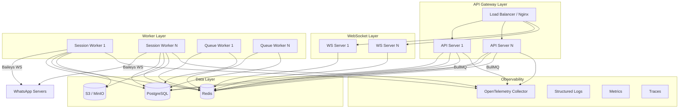
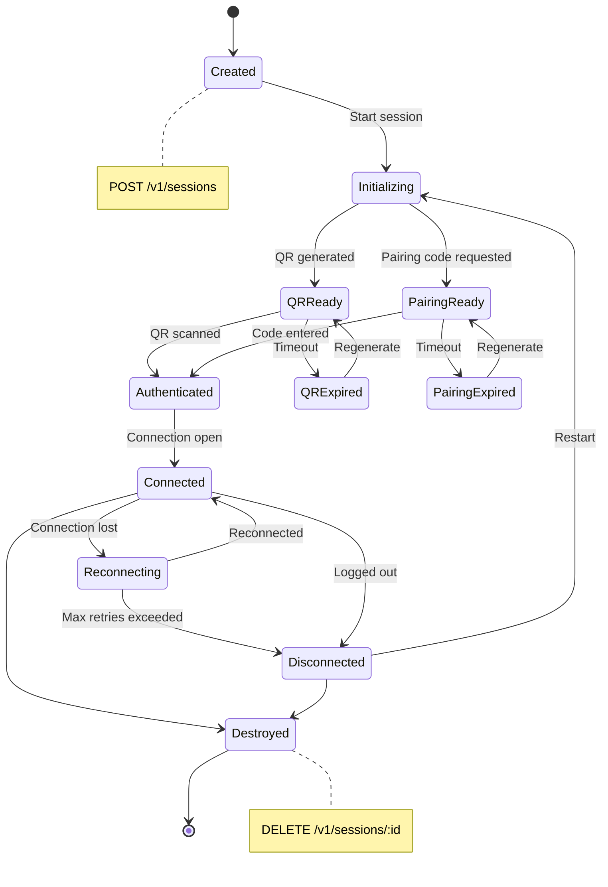
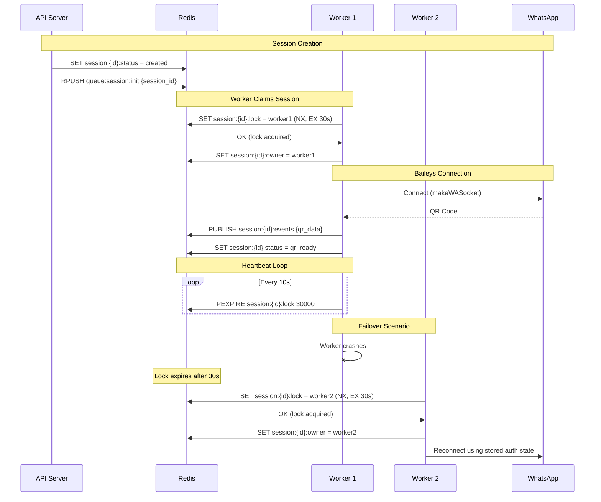
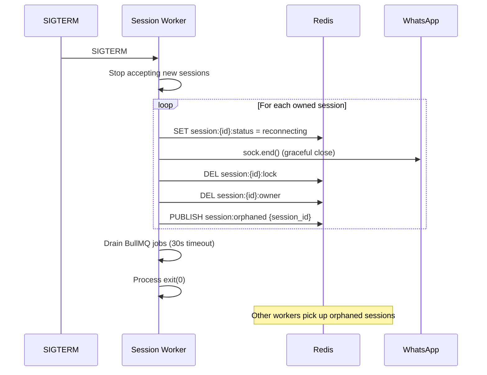
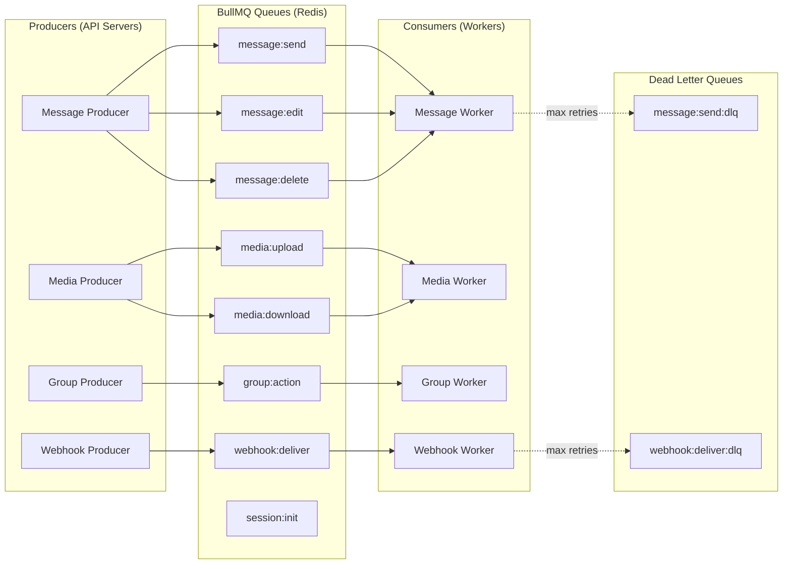
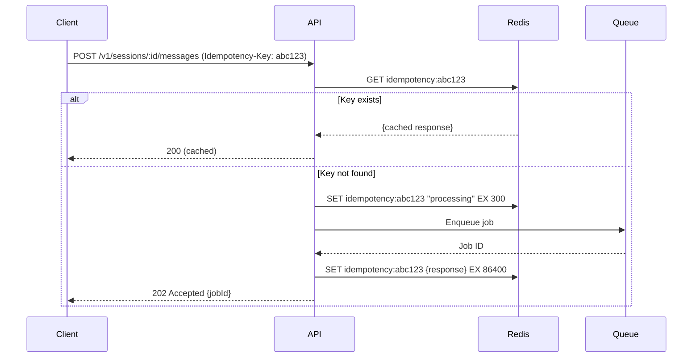

# WhatsApp API Platform — Architecture Blueprint (Part 1/4)

> **Goal:** Production-grade WhatsApp API platform on Baileys — scalable, multi-tenant, event-driven, OpenAPI-first.

> **Approach:** 4-part architecture document. Each part covers 5 deliverables. Review & approve each part before proceeding.

**Tech:** NestJS + Fastify + Prisma + PostgreSQL + Redis + BullMQ + Baileys

---

## 1. High-Level Architecture



### Process Separation

| Process | Role | Scalability |
|---------|------|-------------|
| **API Server** | REST endpoints, request validation, job dispatch | Horizontal — stateless |
| **WS Server** | WebSocket connections to clients, event streaming | Horizontal — Redis pub/sub |
| **Session Worker** | Owns Baileys socket connections to WhatsApp | Horizontal — distributed lock |
| **Queue Worker** | Processes BullMQ jobs (send msg, media, etc.) | Horizontal — consumer groups |

### Key Architectural Decisions

1. **API servers are stateless** — no Baileys connections. All write ops → BullMQ → workers.
2. **Session workers own Baileys sockets** — one worker owns one session via Redis distributed lock.
3. **Redis as nervous system** — pub/sub for events, distributed locks, session registry, cache.
4. **PostgreSQL as source of truth** — all persistent data, audit logs, tenant config.
5. **S3 for binary data** — media files, auth state backups, exports.

---

## 2. Modular Folder Structure

```
src/
├── main.ts                          # Bootstrap (Fastify adapter)
├── app.module.ts                    # Root module composition
│
├── common/                          # Shared infrastructure
│   ├── config/                      # Configuration (env validation)
│   │   ├── app.config.ts
│   │   ├── database.config.ts
│   │   ├── redis.config.ts
│   │   ├── s3.config.ts
│   │   └── config.module.ts
│   ├── decorators/                  # Custom decorators
│   │   ├── api-key.decorator.ts
│   │   ├── tenant.decorator.ts
│   │   ├── capability.decorator.ts
│   │   └── idempotency.decorator.ts
│   ├── filters/                     # Exception filters
│   │   ├── global-exception.filter.ts
│   │   └── baileys-exception.filter.ts
│   ├── guards/                      # Auth guards
│   │   ├── api-key.guard.ts
│   │   ├── jwt.guard.ts
│   │   ├── rbac.guard.ts
│   │   ├── capability.guard.ts
│   │   └── rate-limit.guard.ts
│   ├── interceptors/                # Request/response interceptors
│   │   ├── response-envelope.interceptor.ts
│   │   ├── correlation-id.interceptor.ts
│   │   ├── tracing.interceptor.ts
│   │   └── audit-log.interceptor.ts
│   ├── pipes/                       # Validation pipes
│   │   ├── jid-validation.pipe.ts
│   │   └── pagination.pipe.ts
│   ├── dto/                         # Shared DTOs
│   │   ├── pagination.dto.ts
│   │   ├── response-envelope.dto.ts
│   │   └── error-response.dto.ts
│   ├── interfaces/                  # Shared interfaces
│   │   ├── paginated-result.interface.ts
│   │   └── tenant-context.interface.ts
│   └── utils/                       # Utilities
│       ├── jid.util.ts
│       ├── crypto.util.ts
│       └── retry.util.ts
│
├── database/                        # Prisma & migrations
│   ├── prisma/
│   │   ├── schema.prisma
│   │   └── migrations/
│   ├── prisma.module.ts
│   └── prisma.service.ts
│
├── redis/                           # Redis module
│   ├── redis.module.ts
│   ├── redis.service.ts
│   └── redis-lock.service.ts
│
├── queue/                           # BullMQ infrastructure
│   ├── queue.module.ts
│   ├── producers/
│   │   ├── message.producer.ts
│   │   ├── media.producer.ts
│   │   ├── group.producer.ts
│   │   └── webhook.producer.ts
│   ├── consumers/
│   │   ├── message.consumer.ts
│   │   ├── media.consumer.ts
│   │   ├── group.consumer.ts
│   │   └── webhook.consumer.ts
│   └── strategies/
│       ├── retry.strategy.ts
│       ├── dead-letter.strategy.ts
│       └── idempotency.strategy.ts
│
├── modules/                         # Feature modules
│   ├── auth/                        # Authentication & API keys
│   │   ├── auth.module.ts
│   │   ├── auth.controller.ts
│   │   ├── auth.service.ts
│   │   ├── strategies/
│   │   │   ├── api-key.strategy.ts
│   │   │   └── jwt.strategy.ts
│   │   └── dto/
│   │
│   ├── tenant/                      # Multi-tenant management
│   │   ├── tenant.module.ts
│   │   ├── tenant.controller.ts
│   │   ├── tenant.service.ts
│   │   └── dto/
│   │
│   ├── session/                     # WhatsApp session lifecycle
│   │   ├── session.module.ts
│   │   ├── session.controller.ts
│   │   ├── session.service.ts
│   │   ├── session-registry.service.ts    # Redis session tracking
│   │   ├── session-lifecycle.service.ts   # State machine
│   │   ├── baileys-adapter.service.ts     # Baileys socket wrapper
│   │   ├── auth-state-provider.ts         # Prisma auth state
│   │   └── dto/
│   │
│   ├── messaging/                   # Send/receive messages
│   │   ├── messaging.module.ts
│   │   ├── messaging.controller.ts
│   │   ├── messaging.service.ts
│   │   └── dto/
│   │
│   ├── chat/                        # Chat management
│   │   ├── chat.module.ts
│   │   ├── chat.controller.ts
│   │   ├── chat.service.ts
│   │   └── dto/
│   │
│   ├── contact/                     # Contact management
│   │   ├── contact.module.ts
│   │   ├── contact.controller.ts
│   │   ├── contact.service.ts
│   │   └── dto/
│   │
│   ├── group/                       # Group management
│   │   ├── group.module.ts
│   │   ├── group.controller.ts
│   │   ├── group.service.ts
│   │   └── dto/
│   │
│   ├── community/                   # Communities (planned)
│   │   └── ...
│   │
│   ├── newsletter/                  # Newsletter/channels
│   │   ├── newsletter.module.ts
│   │   ├── newsletter.controller.ts
│   │   ├── newsletter.service.ts
│   │   └── dto/
│   │
│   ├── call/                        # Call events
│   │   ├── call.module.ts
│   │   ├── call.controller.ts
│   │   ├── call.service.ts
│   │   └── dto/
│   │
│   ├── presence/                    # Presence tracking
│   │   ├── presence.module.ts
│   │   ├── presence.controller.ts
│   │   ├── presence.service.ts
│   │   └── dto/
│   │
│   ├── privacy/                     # Privacy settings
│   │   ├── privacy.module.ts
│   │   ├── privacy.controller.ts
│   │   ├── privacy.service.ts
│   │   └── dto/
│   │
│   ├── business/                    # Business profile (planned)
│   │   └── ...
│   │
│   ├── catalog/                     # Product catalog (planned)
│   │   └── ...
│   │
│   ├── label/                       # Labels/tags
│   │   ├── label.module.ts
│   │   ├── label.controller.ts
│   │   ├── label.service.ts
│   │   └── dto/
│   │
│   ├── media/                       # Media handling
│   │   ├── media.module.ts
│   │   ├── media.controller.ts
│   │   ├── media.service.ts
│   │   ├── media-storage.service.ts  # S3 adapter
│   │   └── dto/
│   │
│   ├── webhook/                     # Webhook management
│   │   ├── webhook.module.ts
│   │   ├── webhook.controller.ts
│   │   ├── webhook.service.ts
│   │   ├── webhook-delivery.service.ts
│   │   └── dto/
│   │
│   ├── event/                       # Event system
│   │   ├── event.module.ts
│   │   ├── event-bus.service.ts       # Internal event bus
│   │   ├── event-normalizer.service.ts # Baileys → internal events
│   │   ├── event-store.service.ts     # Event persistence
│   │   └── dto/
│   │
│   ├── capability/                  # Feature flags per session
│   │   ├── capability.module.ts
│   │   ├── capability.service.ts
│   │   └── dto/
│   │
│   ├── analytics/                   # Usage analytics
│   │   ├── analytics.module.ts
│   │   ├── analytics.controller.ts
│   │   ├── analytics.service.ts
│   │   └── dto/
│   │
│   └── feature-flag/                # Global feature flags
│       ├── feature-flag.module.ts
│       ├── feature-flag.service.ts
│       └── dto/
│
├── websocket/                       # WS gateway for clients
│   ├── ws.module.ts
│   ├── ws.gateway.ts
│   ├── ws-auth.guard.ts
│   └── ws-subscription.service.ts
│
└── observability/                   # Logging, metrics, tracing
    ├── observability.module.ts
    ├── logger.service.ts
    ├── metrics.service.ts
    └── tracing.service.ts
```

---

## 3. Database ERD

```mermaid
erDiagram
    Tenant ||--o{ ApiKey : has
    Tenant ||--o{ Session : owns
    Tenant ||--o{ Webhook : configures
    Tenant ||--o{ TenantUser : has_members
    
    Session ||--o{ AuthState : stores
    Session ||--o{ Message : contains
    Session ||--o{ Chat : tracks
    Session ||--o{ Contact : tracks
    Session ||--o{ Group : tracks
    Session ||--o{ SessionCapability : has
    Session ||--o{ SessionEvent : emits
    
    Webhook ||--o{ WebhookDelivery : delivers
    
    Tenant {
        uuid id PK
        string name
        string slug UK
        enum plan "free|pro|enterprise"
        jsonb settings
        boolean active
        timestamp created_at
        timestamp updated_at
    }
    
    TenantUser {
        uuid id PK
        uuid tenant_id FK
        string email UK
        string password_hash
        enum role "owner|admin|member"
        timestamp created_at
    }
    
    ApiKey {
        uuid id PK
        uuid tenant_id FK
        string key_hash UK
        string key_prefix "first 8 chars"
        string name
        jsonb permissions
        timestamp expires_at
        timestamp last_used_at
        boolean revoked
        timestamp created_at
    }
    
    Session {
        uuid id PK
        uuid tenant_id FK
        string name UK
        enum status "created|initializing|qr_ready|pairing|authenticated|connected|reconnecting|disconnected|destroyed"
        string phone_number
        string worker_id "which worker owns it"
        jsonb config
        timestamp last_active_at
        timestamp created_at
        timestamp updated_at
    }
    
    SessionCapability {
        uuid id PK
        uuid session_id FK
        string capability "messaging|groups|calls|business|newsletter|presence|privacy|labels"
        boolean enabled
        timestamp updated_at
    }
    
    AuthState {
        uuid id PK
        uuid session_id FK
        string type "creds|app-state-sync-key|sender-key|session|pre-key"
        string key_id
        bytea data "encrypted"
        timestamp updated_at
    }
    
    Message {
        uuid id PK
        uuid session_id FK
        string message_id "WA message ID"
        string remote_jid
        boolean from_me
        string participant
        enum status "pending|sent|delivered|read|played|failed"
        jsonb content
        jsonb context_info
        bigint timestamp
        timestamp created_at
    }
    
    Chat {
        uuid id PK
        uuid session_id FK
        string jid UK
        string name
        integer unread_count
        boolean archived
        boolean pinned
        bigint mute_end_time
        bigint conversation_timestamp
        timestamp updated_at
    }
    
    Contact {
        uuid id PK
        uuid session_id FK
        string jid UK
        string name
        string push_name
        string profile_picture_url
        timestamp updated_at
    }
    
    Group {
        uuid id PK
        uuid session_id FK
        string jid UK
        string subject
        string description
        string owner_jid
        jsonb participants
        jsonb settings
        timestamp updated_at
    }
    
    Webhook {
        uuid id PK
        uuid tenant_id FK
        string url
        string secret
        jsonb events "filter array"
        jsonb headers "custom headers"
        boolean active
        integer max_retries
        timestamp created_at
    }
    
    WebhookDelivery {
        uuid id PK
        uuid webhook_id FK
        string event_type
        jsonb payload
        integer http_status
        integer attempt
        enum status "pending|delivered|failed|dead_letter"
        string error_message
        timestamp delivered_at
        timestamp created_at
    }
    
    SessionEvent {
        uuid id PK
        uuid session_id FK
        string event_type
        jsonb payload
        bigint sequence_number
        timestamp created_at
    }
    
    AuditLog {
        uuid id PK
        uuid tenant_id FK
        uuid user_id FK
        string action
        string resource_type
        string resource_id
        jsonb metadata
        string ip_address
        timestamp created_at
    }
    
    IdempotencyKey {
        uuid id PK
        string key UK
        uuid tenant_id FK
        jsonb response
        integer status_code
        timestamp expires_at
        timestamp created_at
    }
```



### Key Indexes

```sql
-- Session lookup
CREATE INDEX idx_session_tenant_status ON session(tenant_id, status);
CREATE INDEX idx_session_worker ON session(worker_id) WHERE status IN ('connected','reconnecting');

-- Message queries  
CREATE INDEX idx_message_session_jid ON message(session_id, remote_jid, timestamp DESC);
CREATE INDEX idx_message_wa_id ON message(session_id, message_id);

-- Auth state
CREATE UNIQUE INDEX idx_auth_state_key ON auth_state(session_id, type, key_id);

-- Webhook delivery retry
CREATE INDEX idx_webhook_delivery_pending ON webhook_delivery(status, created_at) WHERE status = 'pending';

-- Event replay
CREATE INDEX idx_session_event_replay ON session_event(session_id, sequence_number);

-- Idempotency cleanup
CREATE INDEX idx_idempotency_expires ON idempotency_key(expires_at);

-- Audit log time-range
CREATE INDEX idx_audit_log_tenant_time ON audit_log(tenant_id, created_at DESC);
```

---

## 4. Session Lifecycle Flow



### Session Ownership Model



### Reconnect Strategy

```typescript
// Pseudocode for reconnect logic in session worker
interface ReconnectConfig {
  maxRetries: 5;
  baseDelayMs: 1000;
  maxDelayMs: 60000;
  backoffMultiplier: 2;
  jitterFactor: 0.3;
}

// Delay calculation: min(base * multiplier^attempt + jitter, max)
```

### Graceful Shutdown



---

## 5. Queue Architecture

### Queue Topology



### Queue Configuration

| Queue | Concurrency | Max Retries | Backoff | Priority Levels | TTL |
|-------|------------|-------------|---------|-----------------|-----|
| `message:send` | 10 | 3 | exponential 1s | 3 (high/normal/low) | 5min |
| `message:edit` | 5 | 2 | fixed 2s | 1 | 2min |
| `message:delete` | 5 | 2 | fixed 2s | 1 | 2min |
| `media:upload` | 3 | 3 | exponential 5s | 2 | 10min |
| `media:download` | 5 | 3 | exponential 2s | 1 | 5min |
| `group:action` | 5 | 2 | fixed 3s | 1 | 5min |
| `webhook:deliver` | 20 | 5 | exponential 10s | 2 | 30min |
| `session:init` | 3 | 2 | fixed 5s | 1 | 2min |

### Job Schema Example

```typescript
// message:send job
interface SendMessageJob {
  id: string;                    // UUID
  idempotencyKey: string;        // Client-provided
  tenantId: string;
  sessionId: string;
  to: string;                    // JID
  content: MessageContent;       // text/media/location/contact/poll
  options?: {
    quoted?: string;             // message ID to quote
    ephemeral?: number;          // disappearing timer
    mentions?: string[];
  };
  priority: 'high' | 'normal' | 'low';
  correlationId: string;         // Request tracing
  createdAt: string;             // ISO timestamp
}
```

### Idempotency Strategy



### Dead Letter Queue Handling

```typescript
// DLQ processor pseudocode
interface DLQEntry {
  originalQueue: string;
  jobData: unknown;
  failedAttempts: number;
  lastError: string;
  failedAt: string;
  action: 'retry' | 'discard' | 'manual';
}

// Admin endpoints:
// GET    /v1/admin/dlq                    → list DLQ entries
// POST   /v1/admin/dlq/:id/retry          → retry single
// POST   /v1/admin/dlq/retry-all          → retry batch
// DELETE /v1/admin/dlq/:id                → discard
```

---

## Open Questions

> [!IMPORTANT]
>
> 1. **Deployment target** — Docker Compose for dev, Kubernetes for prod? Or single-server mode support juga?
> 2. **S3 provider** — MinIO self-hosted atau AWS S3 compatible? Perlu abstract storage interface?
> 3. **Auth complexity** — JWT diperlukan untuk dashboard web, atau API Key saja cukup untuk V1?
> 4. **Max sessions per tenant** — perlu hard limit per plan? (free=2, pro=10, enterprise=unlimited?)
> 5. **Media size limits** — follow WhatsApp limits (16MB images, 64MB video) atau tambah server-side limits?

---

## Next Parts

- **Part 2:** Event Architecture, WebSocket Architecture, Capability System, Redis Key Design, Worker Architecture
- **Part 3:** Multi-tenant Architecture, Horizontal Scaling, Deployment Topology, OpenAPI Design Guidelines, Security
- **Part 4:** Sequence Diagrams, Production Best Practices, Failure Recovery, Module Boundaries, Coding Standards, Microservice Extraction

**Review Part 1 → jawab open questions → proceed Part 2.**
