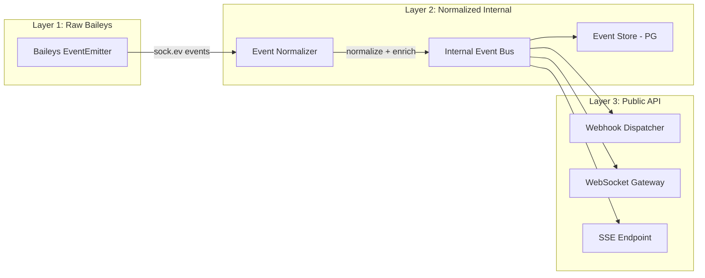
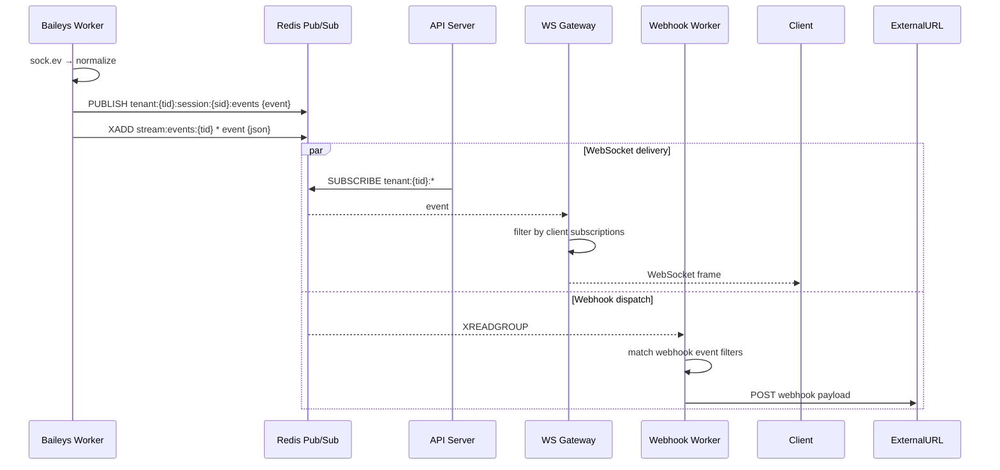
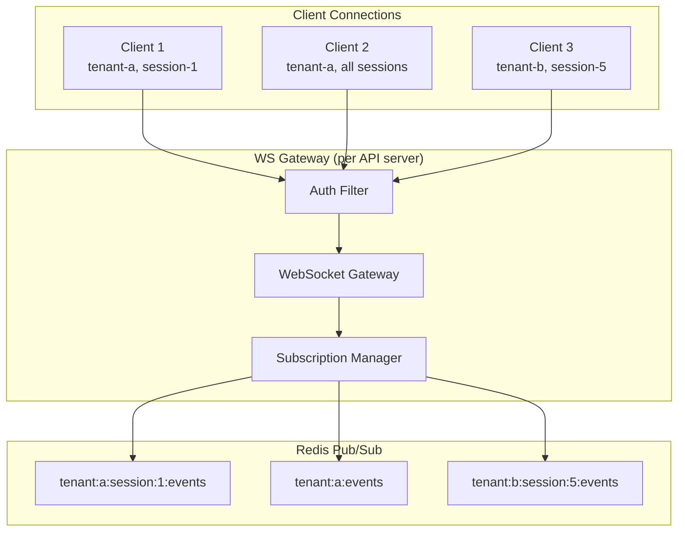
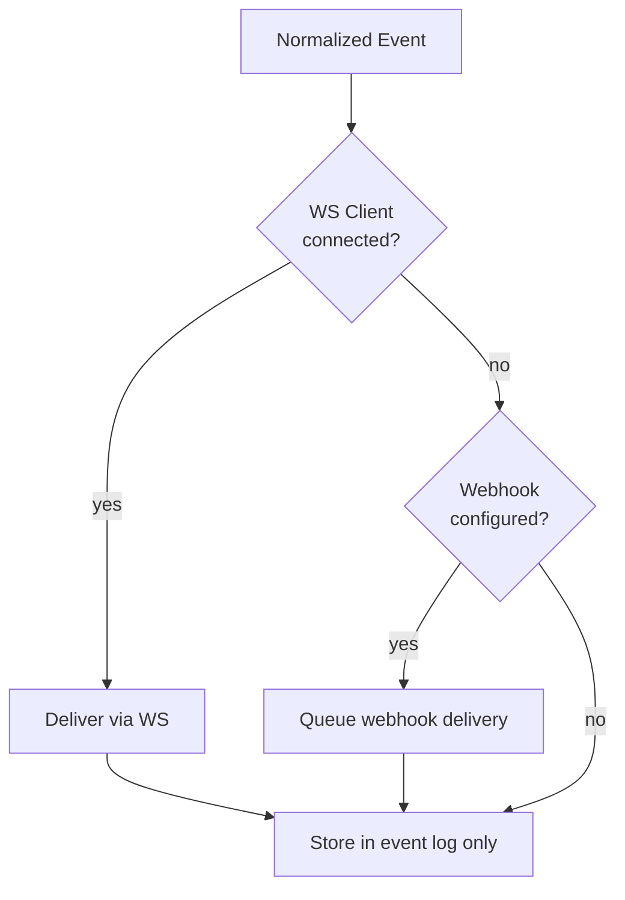
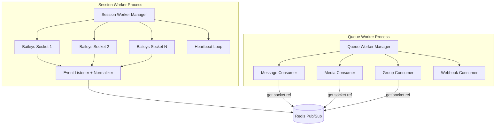
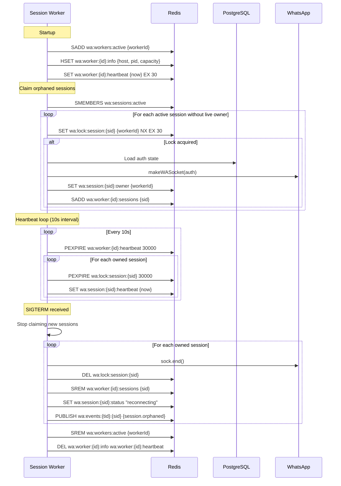
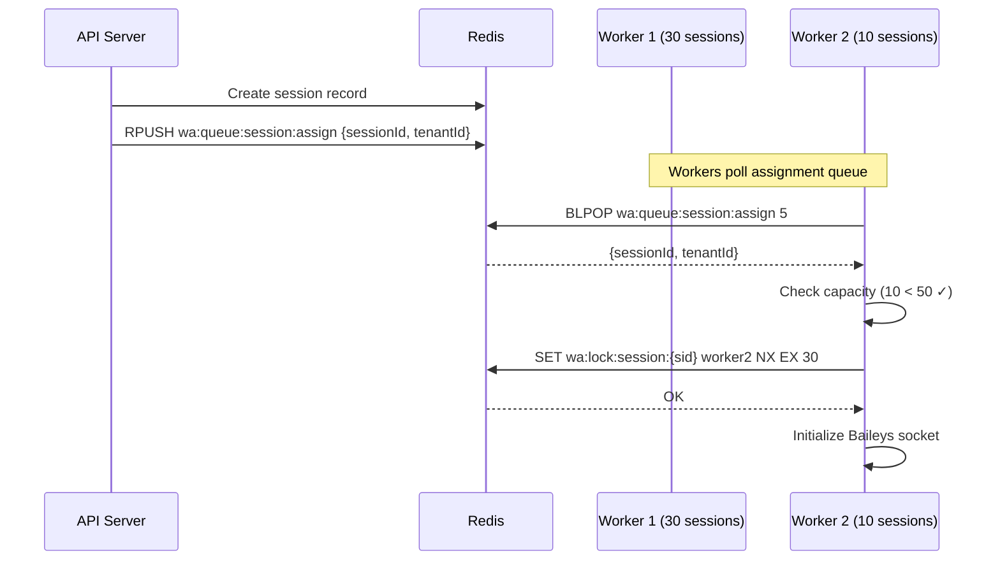
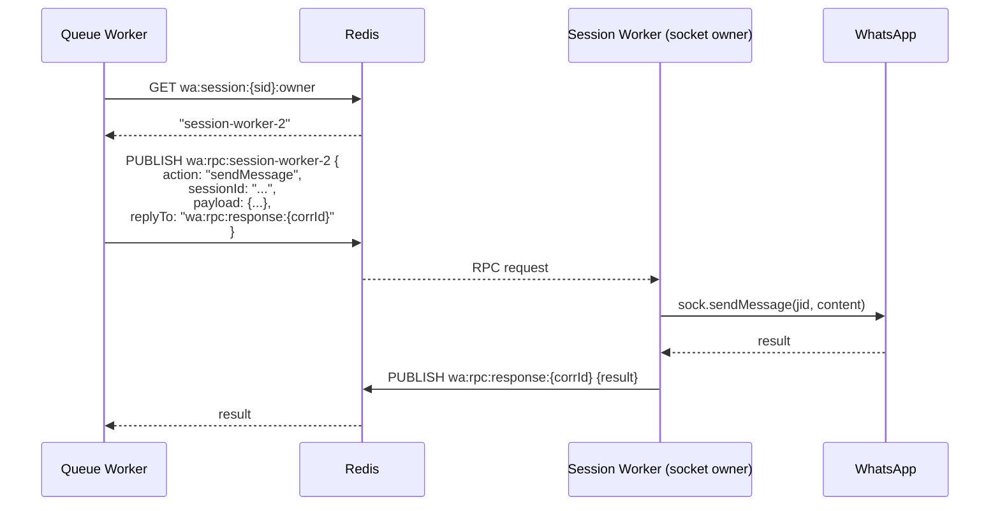

# WhatsApp API Platform — Architecture Blueprint (Part 2/4)

> Decisions locked from Part 1 review:
> - **Deploy**: single-node / docker-compose / k8s — no code change
> - **Storage**: abstract interface, RustFS/MinIO dev, S3-compatible prod
> - **Auth**: API Key (M2M) + JWT (dashboard), separated
> - **Limits**: operator-defined, configurable global/per-tenant, no billing plans
> - **Media**: WA hard limits + server-side configurable + stream/chunk/resumable/presigned upload
> - **Philosophy**: self-hosted first, portability, pluggable infra, low vendor lock-in

---

## 6. Event Architecture

### 3-Layer Event Pipeline



### Layer 1 → Layer 2: Event Normalization

```typescript
// Raw Baileys event
interface RawBaileysEvent {
  event: string;           // e.g. "messages.upsert"
  data: unknown;           // raw Baileys payload
  sessionId: string;
  timestamp: number;
}

// Normalized internal event
interface NormalizedEvent {
  id: string;              // UUID
  tenantId: string;
  sessionId: string;
  type: string;            // e.g. "message.received"
  category: EventCategory; // message | chat | contact | group | ...
  data: Record<string, unknown>; // structured, consistent shape
  metadata: {
    source: 'baileys' | 'system' | 'api';
    rawEvent?: string;     // original Baileys event name
    correlationId?: string;
    sequence: bigint;      // monotonic per session
  };
  timestamp: string;       // ISO 8601
}

type EventCategory =
  | 'connection' | 'message' | 'chat' | 'contact'
  | 'group' | 'presence' | 'call' | 'newsletter'
  | 'label' | 'privacy' | 'session' | 'system';
```

### Event Name Mapping (Baileys → Public API)

| Baileys Event | Public API Event | Category |
|---|---|---|
| `connection.update` | `session.connection.updated` | connection |
| `creds.update` | *(internal only)* | — |
| `messages.upsert` | `message.received` / `message.sent` | message |
| `messages.update` | `message.updated` | message |
| `messages.delete` | `message.deleted` | message |
| `messages.reaction` | `message.reaction` | message |
| `message-receipt.update` | `message.receipt.updated` | message |
| `chats.upsert` | `chat.created` | chat |
| `chats.update` | `chat.updated` | chat |
| `chats.delete` | `chat.deleted` | chat |
| `contacts.upsert` | `contact.created` | contact |
| `contacts.update` | `contact.updated` | contact |
| `groups.upsert` | `group.created` | group |
| `groups.update` | `group.updated` | group |
| `group-participants.update` | `group.participant.updated` | group |
| `presence.update` | `presence.updated` | presence |
| `call` | `call.received` | call |
| `labels.edit` | `label.updated` | label |
| `labels.association` | `label.association.updated` | label |
| `messaging-history.set` | `history.synced` | system |
| `newsletter.reaction` | `newsletter.reaction` | newsletter |

### Event Persistence & Replay

```typescript
// Event store — append-only, per-session sequence
interface EventStoreEntry {
  id: string;
  sessionId: string;
  tenantId: string;
  sequence: bigint;        // auto-increment per session
  eventType: string;
  payload: JsonValue;
  createdAt: Date;
}

// Replay API
// GET /v1/sessions/:id/events?after_sequence=1500&limit=100
// GET /v1/sessions/:id/events?since=2026-05-01T00:00:00Z
// GET /v1/sessions/:id/events?types=message.received,message.sent
```

### Event Flow — Internal Bus



---

## 7. WebSocket Architecture

### Connection Model



### WS Protocol

```typescript
// Client → Server messages
type WSClientMessage =
  | { type: 'subscribe'; channels: SubscriptionChannel[] }
  | { type: 'unsubscribe'; channels: string[] }
  | { type: 'ping' }
  | { type: 'replay'; sessionId: string; afterSequence: bigint; limit?: number };

interface SubscriptionChannel {
  scope: 'session' | 'tenant';
  sessionId?: string;         // required when scope=session
  events?: string[];          // filter: ['message.*', 'group.*']
}

// Server → Client messages
type WSServerMessage =
  | { type: 'event'; channel: string; data: NormalizedEvent }
  | { type: 'batch'; channel: string; events: NormalizedEvent[] }
  | { type: 'replay'; sessionId: string; events: NormalizedEvent[]; hasMore: boolean }
  | { type: 'subscribed'; channels: string[] }
  | { type: 'unsubscribed'; channels: string[] }
  | { type: 'error'; code: string; message: string }
  | { type: 'pong' };
```

### Event Batching

```typescript
interface BatchConfig {
  maxBatchSize: 50;          // max events per batch
  flushIntervalMs: 100;     // flush every 100ms
  maxDelayMs: 500;          // never delay more than 500ms
}
// Events accumulate → flush when maxBatchSize OR flushIntervalMs reached
// High-priority events (connection.*, error.*) bypass batching → immediate
```

### WS Authentication

```typescript
// Option 1: Query param (initial connection)
// ws://host/v1/ws?token=<api-key-or-jwt>

// Option 2: First message auth
// { type: 'auth', token: '<api-key-or-jwt>' }
// Server responds: { type: 'authenticated', tenantId: '...' }
// OR: { type: 'error', code: 'AUTH_FAILED' } → close(4001)

// Token validation → extract tenantId → scope all subscriptions
```

### WS Rate Limiting

| Action | Limit | Window |
|--------|-------|--------|
| New connections per tenant | 10 | 1 min |
| Subscribe requests | 20 | 1 min |
| Messages per connection | 100 | 1 min |
| Replay requests | 5 | 1 min |

### Webhook Fallback



> [!NOTE]
> Webhooks always fire if configured, regardless of WS connection state. WS and webhook are **parallel**, not fallback. The "fallback" is: if neither WS nor webhook configured, events are still persisted for replay.

---

## 8. Capability System

### Design

```typescript
// Default capabilities for new sessions
const DEFAULT_CAPABILITIES: Record<string, boolean> = {
  'messaging': true,
  'messaging.text': true,
  'messaging.media': true,
  'messaging.location': true,
  'messaging.contact': true,
  'messaging.poll': true,
  'messaging.reaction': true,
  'messaging.status': false,     // opt-in
  'chat': true,
  'contact': true,
  'group': true,
  'group.admin': true,
  'community': false,            // planned
  'newsletter': false,           // experimental
  'call': false,                 // opt-in
  'presence': true,
  'privacy': true,
  'business': false,             // planned
  'catalog': false,              // planned
  'label': true,
  'media.upload': true,
  'media.download': true,
  'webhook': true,
};
```

### Capability Guard

```typescript
// Decorator usage on controllers
@Post('send')
@RequireCapability('messaging')  // or 'messaging.text'
async sendMessage(@Body() dto: SendMessageDto) { ... }

@Post(':groupId/participants')
@RequireCapability('group.admin')
async updateParticipants(@Body() dto: UpdateParticipantsDto) { ... }

// Guard implementation pseudocode
@Injectable()
class CapabilityGuard implements CanActivate {
  canActivate(context: ExecutionContext): boolean {
    const required = Reflector.get('capability', handler);
    const sessionId = request.params.sessionId;
    const capabilities = capabilityService.getForSession(sessionId);
    
    if (!capabilities[required]) {
      throw new ForbiddenException({
        success: false,
        error: {
          code: 'FEATURE_NOT_ENABLED',
          message: `Capability '${required}' is not enabled for this session`,
          capability: required,
        }
      });
    }
    return true;
  }
}
```

### Capability API

```
GET    /v1/sessions/:id/capabilities           → list all
PUT    /v1/sessions/:id/capabilities           → bulk update
PATCH  /v1/sessions/:id/capabilities/:name     → toggle single
GET    /v1/capabilities                        → list available + metadata
```

### Capability Metadata

```typescript
interface CapabilityDefinition {
  name: string;
  description: string;
  stability: 'stable' | 'beta' | 'experimental' | 'planned' | 'deprecated';
  dependencies?: string[];     // e.g. 'group.admin' requires 'group'
  default: boolean;
  configurable: boolean;       // some are always-on
}
```

---

## 9. Redis Key Design

### Namespace Convention

```
{prefix}:{resource}:{id}:{sub-resource}
```

Default prefix: `wa` (configurable via env `REDIS_KEY_PREFIX`).

### Complete Key Schema

```
# ─── Session Management ────────────────────────
wa:session:{sessionId}:status          → STRING (created|qr_ready|connected|...)
wa:session:{sessionId}:owner           → STRING (workerId)
wa:session:{sessionId}:lock            → STRING (workerId) [NX, EX 30]
wa:session:{sessionId}:config          → HASH  {capabilities, settings}
wa:session:{sessionId}:heartbeat       → STRING (unix_ms) [EX 30]
wa:session:{sessionId}:qr             → STRING (qr_data) [EX 60]
wa:session:{sessionId}:reconnect      → HASH  {attempts, lastAttempt, nextDelay}

# ─── Session Registry ──────────────────────────
wa:tenant:{tenantId}:sessions          → SET   {sessionId, sessionId, ...}
wa:worker:{workerId}:sessions          → SET   {sessionId, sessionId, ...}
wa:sessions:active                     → SET   {sessionId, ...} (global)

# ─── Event Pub/Sub Channels ────────────────────
wa:events:{tenantId}:{sessionId}       → PUB/SUB channel
wa:events:{tenantId}:*                 → PUB/SUB pattern (tenant-wide)

# ─── Event Streams (for replay + webhook) ──────
wa:stream:events:{tenantId}            → STREAM (XADD, XREADGROUP)
wa:stream:events:{tenantId}:seq:{sid}  → STRING (last sequence number)

# ─── Presence (ephemeral) ──────────────────────
wa:presence:{sessionId}:{jid}          → HASH  {status, lastSeen} [EX 300]

# ─── Cache ─────────────────────────────────────
wa:cache:group:{sessionId}:{groupJid}  → STRING (JSON metadata) [EX 300]
wa:cache:contact:{sessionId}:{jid}     → STRING (JSON) [EX 600]
wa:cache:profile_pic:{jid}             → STRING (url) [EX 3600]

# ─── Rate Limiting ─────────────────────────────
wa:ratelimit:{tenantId}:{endpoint}     → STRING (counter) [EX window]
wa:ratelimit:{tenantId}:global         → STRING (counter) [EX 60]
wa:ratelimit:ws:{tenantId}:conn        → STRING (counter) [EX 60]

# ─── Idempotency ──────────────────────────────
wa:idempotency:{tenantId}:{key}        → HASH  {status, response, statusCode} [EX 86400]

# ─── Distributed Locks ────────────────────────
wa:lock:session:{sessionId}            → STRING (workerId) [NX, EX 30]
wa:lock:webhook:{webhookId}:{eventId}  → STRING (1) [NX, EX 60]
wa:lock:tenant:{tenantId}:init         → STRING (1) [NX, EX 10]

# ─── Operator-Defined Limits ──────────────────
wa:limits:global                       → HASH  {maxSessions, maxJobsConcurrent, ...}
wa:limits:tenant:{tenantId}            → HASH  {maxSessions, maxJobsConcurrent, ...}
                                       # tenant overrides global if set

# ─── Worker Registry ──────────────────────────
wa:worker:{workerId}:info              → HASH  {host, pid, startedAt, capacity}
wa:worker:{workerId}:heartbeat         → STRING (unix_ms) [EX 30]
wa:workers:active                      → SET   {workerId, ...}

# ─── Queue Metrics (BullMQ native) ────────────
bull:message:send:*                    → (managed by BullMQ)
```

### TTL Policy Summary

| Key Pattern | TTL | Rationale |
|---|---|---|
| `session:*:lock` | 30s | Heartbeat-extended, auto-release on crash |
| `session:*:qr` | 60s | QR expires, regenerate |
| `presence:*` | 5min | Ephemeral, WhatsApp refreshes |
| `cache:group:*` | 5min | Metadata changes infrequently |
| `cache:contact:*` | 10min | Contact info stable |
| `idempotency:*` | 24h | Client retry window |
| `ratelimit:*` | per-window | Sliding window |
| `worker:*:heartbeat` | 30s | Dead worker detection |
| `stream:events:*` | MAXLEN ~10000 | Cap stream size, old events in PG |

---

## 10. Worker Architecture

### Worker Types



### Session Worker Lifecycle



### Worker Capacity & Assignment

```typescript
interface WorkerConfig {
  // Operator-configurable via env
  maxSessionsPerWorker: number;    // default: 50
  heartbeatIntervalMs: number;     // default: 10_000
  lockTtlMs: number;               // default: 30_000
  orphanCheckIntervalMs: number;   // default: 15_000
  gracefulShutdownTimeoutMs: number; // default: 30_000
}

// Assignment strategy: least-loaded
// When API creates session → find worker with fewest sessions
// Worker self-assigns via lock if under capacity
```

### Session Assignment Flow



### Queue Worker Design

```typescript
// Each queue worker can process multiple queue types
// Concurrency is per-queue, configurable

interface QueueWorkerConfig {
  queues: {
    'message:send': { concurrency: 10, limiter: { max: 30, duration: 1000 } };
    'message:edit': { concurrency: 5 };
    'message:delete': { concurrency: 5 };
    'media:upload': { concurrency: 3, limiter: { max: 5, duration: 5000 } };
    'media:download': { concurrency: 5 };
    'group:action': { concurrency: 5 };
    'webhook:deliver': { concurrency: 20, limiter: { max: 50, duration: 1000 } };
  };
}

// Queue worker gets Baileys socket reference:
// 1. Job contains sessionId
// 2. Worker looks up session owner: GET wa:session:{sid}:owner → workerId
// 3. If owner is THIS process → use local socket reference
// 4. If owner is DIFFERENT process → RPC via Redis pub/sub
//    PUBLISH wa:rpc:{workerId} {action, sessionId, payload}
//    SUBSCRIBE wa:rpc:{workerId}:response:{correlationId}
```

### Worker ↔ Worker RPC (for queue workers needing Baileys socket)



### Unified Worker Process Mode (Single-Node)

```typescript
// In single-node mode, ONE process runs everything:
// - API server (Fastify)
// - WebSocket gateway
// - Session worker (Baileys sockets)
// - Queue workers (BullMQ consumers)
//
// Controlled by env: WORKER_MODE=unified|api|session|queue|ws
//
// unified  → all-in-one (dev / small deploy)
// api      → REST API + WS gateway only
// session  → Baileys socket management only
// queue    → BullMQ consumers only
// ws       → WebSocket gateway only (large scale)
```

```typescript
// main.ts bootstrap logic (pseudocode)
async function bootstrap() {
  const mode = config.get('WORKER_MODE') || 'unified';
  
  const moduleImports = [CommonModule, DatabaseModule, RedisModule];
  
  if (['unified', 'api'].includes(mode)) {
    moduleImports.push(ApiModule, WebSocketModule);
  }
  if (['unified', 'session'].includes(mode)) {
    moduleImports.push(SessionWorkerModule);
  }
  if (['unified', 'queue'].includes(mode)) {
    moduleImports.push(QueueWorkerModule);
  }
  
  const app = await NestFactory.create(
    DynamicRootModule.forMode(mode, moduleImports),
    new FastifyAdapter(),
  );
  
  await app.listen(config.get('PORT'));
}
```

---

## Open Questions (Part 2)

> [!IMPORTANT]
> 1. **RPC transport** — Redis pub/sub for worker↔worker RPC is simple but lossy. Alternative: use BullMQ job for RPC (guaranteed delivery, slower). Preference?
> 2. **Event stream retention** — Redis Streams MAXLEN 10K per tenant + PostgreSQL for long-term. Or skip Redis Streams entirely and use PG + pub/sub only?
> 3. **WebSocket library** — NestJS built-in `@nestjs/websockets` with `ws` adapter, or Socket.IO for auto-reconnect/rooms? Socket.IO adds vendor weight but simplifies client SDK.

---

## Next Parts

- **Part 3:** Multi-tenant Architecture, Horizontal Scaling, Deployment Topology, OpenAPI Design Guidelines, Security
- **Part 4:** Sequence Diagrams, Production Best Practices, Failure Recovery, Module Boundaries, Coding Standards, Microservice Extraction

**Review Part 2 → jawab open questions → proceed Part 3.**
