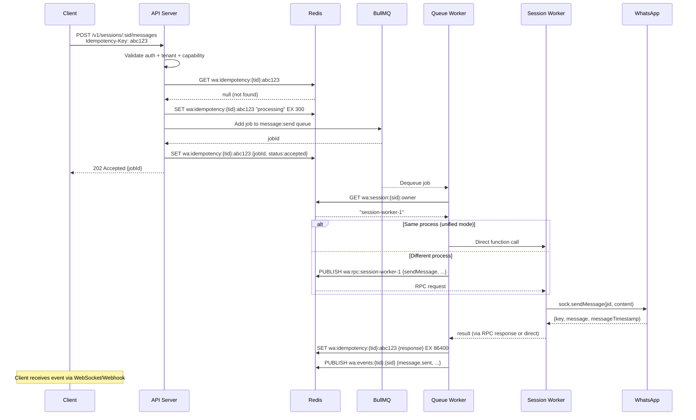
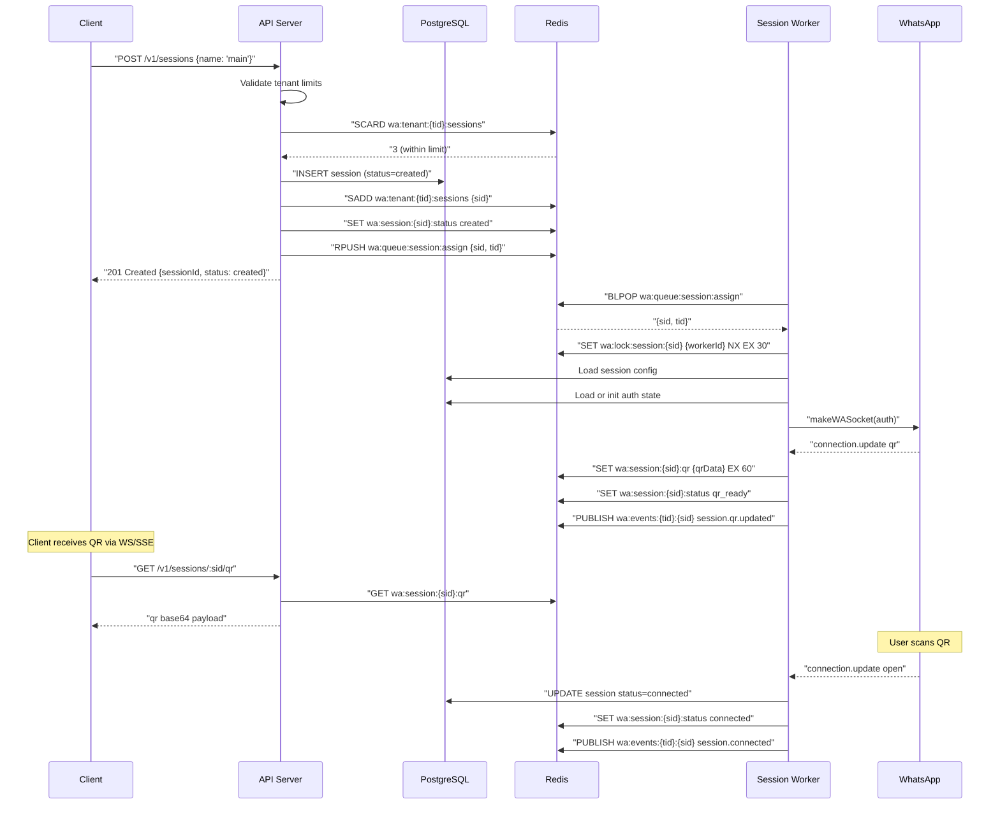
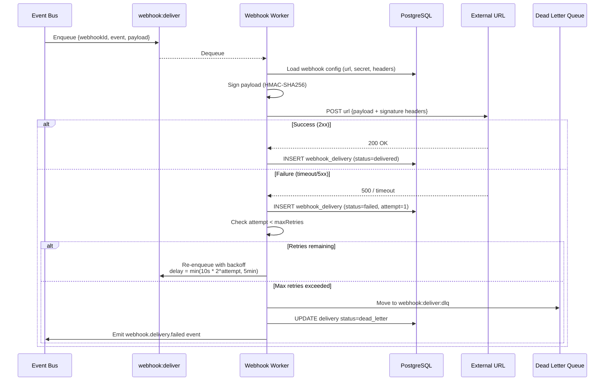
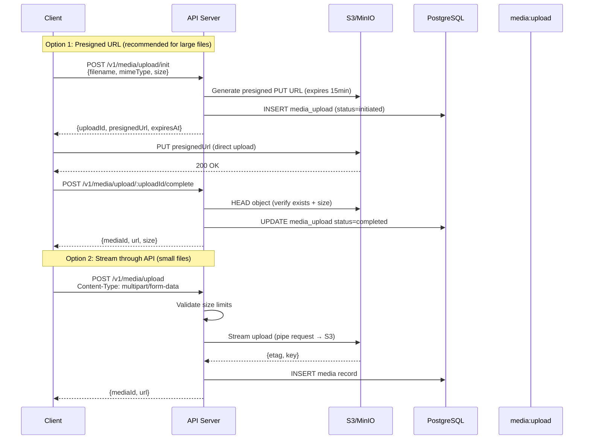
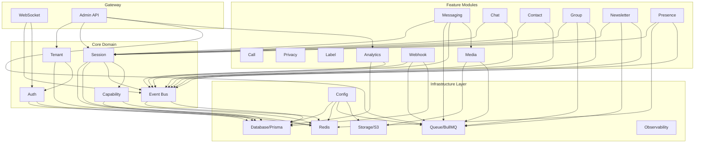
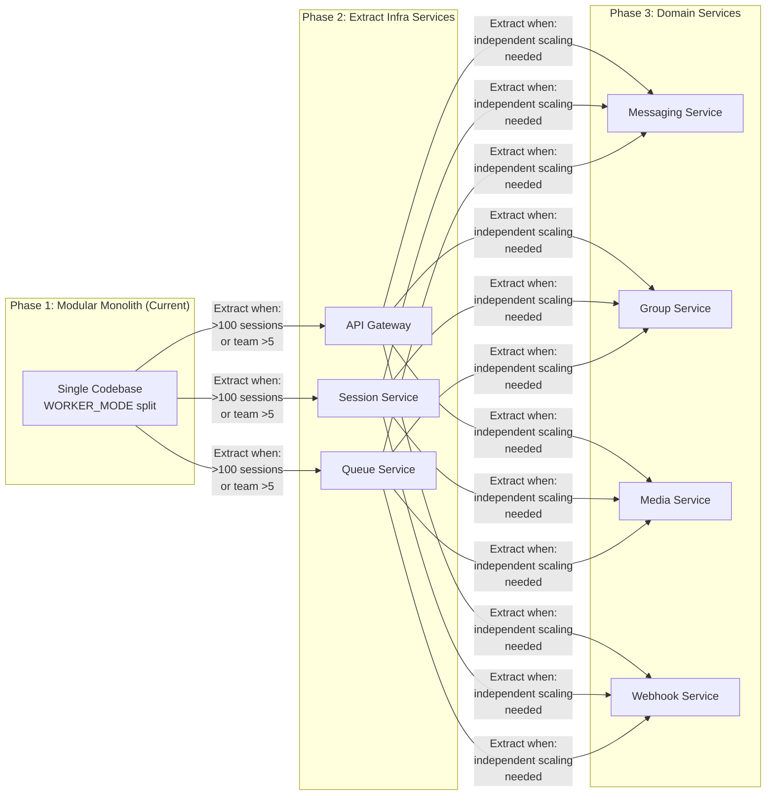

# WhatsApp API Platform — Architecture Blueprint (Part 4/4 — Final)

> Decisions locked from Part 3 review:
> - **Admin API**: same server V1, isolated routes + RBAC, optional separate port, extractable later
> - **Audit log**: default mutations + auth + sensitive reads, configurable modes (off/mutations/sensitive/all)
> - **Auth backup**: immediate to DB, debounced S3 snapshots, scheduled + lifecycle-triggered, always encrypted

---

## 16. Sequence Diagrams

### Send Message (Full Flow)



### Session Creation + QR Auth



### Webhook Delivery with Retry



### Media Upload (Chunk/Resumable)



---

## 17. Production Best Practices

### Health Checks

```typescript
// Liveness — is process alive?
// GET /health/live → 200 { status: 'ok' }

// Readiness — can process serve traffic?
// GET /health/ready → 200 or 503
interface ReadinessCheck {
  database: 'ok' | 'error';   // PG ping
  redis: 'ok' | 'error';      // Redis ping
  storage: 'ok' | 'error';    // S3 head bucket
}

// Startup — has initialization completed?
// GET /health/startup → 200 or 503
// Returns 503 until migrations run + modules initialized
```

### Structured Logging

```typescript
// Every log line = JSON with consistent fields
interface LogEntry {
  level: 'debug' | 'info' | 'warn' | 'error';
  message: string;
  timestamp: string;           // ISO 8601
  service: string;             // worker mode
  workerId: string;
  correlationId?: string;      // request trace
  tenantId?: string;
  sessionId?: string;
  // Contextual fields
  [key: string]: unknown;
}

// Logger: pino (fastest JSON logger for Node.js)
// Levels per env:
//   development: debug
//   staging: info
//   production: warn (with info for audit-tagged)
```

### Graceful Shutdown Sequence

```
SIGTERM received
  │
  ├─ 1. Stop accepting new HTTP connections (Fastify.close())
  ├─ 2. Stop accepting new WS connections
  ├─ 3. Close existing WS connections (send close frame)
  ├─ 4. Stop BullMQ workers (worker.close())
  ├─ 5. Wait for in-flight jobs to complete (30s timeout)
  ├─ 6. Release all session locks (Redis DEL)
  ├─ 7. Mark sessions as reconnecting
  ├─ 8. Close Baileys sockets gracefully
  ├─ 9. Close Redis connections
  ├─ 10. Close database pool
  └─ 11. process.exit(0)
  
  Total timeout: 30s — force exit after
```

### Backpressure Handling

```typescript
// Queue depth monitoring
// If queue depth > threshold → reject new jobs with 503
interface BackpressureConfig {
  maxQueueDepth: {
    'message:send': 10000,
    'media:upload': 1000,
    'webhook:deliver': 50000,
  };
  // When exceeded:
  // - Return 503 Service Unavailable
  // - Header: Retry-After: 30
  // - Log warning with queue metrics
}

// Session worker backpressure
// If worker at maxSessions capacity → new assignments wait in queue
// API returns session status "queued" until worker picks up
```

### OpenTelemetry Integration

```typescript
// Pluggable — enabled via env: OTEL_ENABLED=true
// Traces: HTTP requests, DB queries, Redis ops, queue jobs
// Metrics: request count/latency, queue depth, session count, error rate
// Export: OTLP (compatible with Jaeger, Grafana Tempo, Datadog)

// Key spans:
// - http.request (incoming)
// - db.query (Prisma)
// - redis.command
// - bullmq.job.process
// - baileys.send_message
// - webhook.deliver
// - s3.upload
```

---

## 18. Failure Recovery Strategy

### Session Worker Crash

```
Scenario: Session worker process dies unexpectedly

Detection:
  - Worker heartbeat (wa:worker:{id}:heartbeat) expires after 30s
  - Session locks (wa:lock:session:{sid}) expire after 30s

Recovery:
  1. Other workers detect orphaned sessions via periodic scan
     (every 15s, check wa:sessions:active for unlocked sessions)
  2. Available worker claims lock: SET wa:lock:session:{sid} NX EX 30
  3. Load auth state from PostgreSQL
  4. Reconnect to WhatsApp using stored credentials
  5. Resume event processing

Data safety:
  - In-flight BullMQ jobs: auto-retried (job marked stalled → retry)
  - Events during gap: WhatsApp delivers on reconnect (message retry)
  - Auth state: persisted in PG, never lost
```

### Database Failover

```
Scenario: PostgreSQL primary goes down

Impact:
  - API: can't create/query sessions, messages
  - Workers: can't persist events, auth state updates queue in memory

Recovery:
  - Read replica promoted (if configured)
  - Application reconnects via Prisma connection pool retry
  - Connection pool config: 
      connectionTimeoutMs: 5000
      pool: { min: 2, max: 20 }
      retries: 3

Degraded mode:
  - Sessions continue running (Baileys sockets stay connected)
  - Events buffered in Redis Streams (survive brief PG outage)
  - API returns 503 for DB-dependent endpoints
  - Health check /health/ready returns 503
```

### Redis Outage

```
Scenario: Redis becomes unavailable

Impact (critical):
  - Session locks lost → potential duplicate ownership
  - Queue jobs stalled
  - Events not distributed
  - Rate limiting disabled
  - Cache unavailable

Recovery:
  - Redis Sentinel or Cluster for HA (recommended for production)
  - Application: retry with exponential backoff
  - Fallback behaviors:
      - Rate limiting: fail-open or fail-closed (configurable)
      - Cache: bypass, hit DB directly (degraded perf)
      - Events: buffer in memory (bounded, drop oldest)
      - Session locks: pause new session claims until Redis returns
  
  - On Redis recovery:
      - Workers re-register and re-acquire locks
      - Stalled BullMQ jobs auto-retry
      - Event distribution resumes
```

### Queue Job Failure Patterns

```
Pattern 1: Transient failure (network timeout to WhatsApp)
  → BullMQ retry with exponential backoff
  → Max 3 retries for messages, 5 for webhooks

Pattern 2: Permanent failure (session disconnected)
  → Check session status before execution
  → If disconnected: move to DLQ, notify via event
  → Admin can retry after session reconnects

Pattern 3: Poison message (invalid payload)
  → Validation at producer side (before enqueue)
  → Consumer catches + moves to DLQ immediately (no retry)
  → Log with full job data for debugging

Pattern 4: Stalled jobs (worker died mid-processing)
  → BullMQ stalledInterval: 30s
  → Auto-retry stalled jobs (counted toward maxRetries)
```

### WhatsApp Rate Limiting / Ban Recovery

```
Scenario: WhatsApp rate limits or temporarily bans the number

Detection:
  - Baileys error codes: 429, 503, connection close with specific reason
  - Repeated send failures

Response:
  1. Exponential backoff on affected session
  2. Pause message queue for that session
     XADD wa:session:{sid}:throttle {until: timestamp}
  3. Return RATE_LIMIT_EXCEEDED for new send requests
  4. Auto-resume after cooldown period
  5. Emit session.throttled event
  
Prevention:
  - Per-session rate limiting (configurable, default 30 msg/min)
  - Queue limiter: { max: 30, duration: 60000 } per session
  - Respect WhatsApp's built-in delays
```

---

## 19. Recommended Module Boundaries

### Module Dependency Graph



### Module Coupling Rules

```
RULE 1: Feature modules NEVER import each other directly
  ✗ MessagingModule imports GroupModule
  ✓ MessagingModule and GroupModule both import SessionModule

RULE 2: Feature modules communicate via Event Bus only
  ✗ GroupService calls MessagingService.sendMessage()
  ✓ GroupService emits 'group.participant.added' → MessagingService listens

RULE 3: Infrastructure modules have zero domain knowledge
  ✗ RedisService has method getSessionStatus()
  ✓ RedisService exposes generic get/set/publish

RULE 4: Core modules define interfaces, features implement
  ✗ SessionModule imports MediaModule to handle media messages
  ✓ SessionModule defines MediaHandler interface → MediaModule provides impl

RULE 5: All cross-module communication uses well-defined DTOs
  ✗ Passing Prisma model types across modules
  ✓ Passing plain DTOs/interfaces defined in the consuming module
```

### Module Size Guidelines

```
Small module (1 dev-day to understand):
  - 1 controller, 1-2 services, 3-5 DTOs
  - Examples: Label, Presence, Privacy, Call

Medium module (2-3 dev-days):
  - 1-2 controllers, 3-5 services, 5-10 DTOs
  - Examples: Messaging, Group, Webhook, Media

Large module (should consider splitting):
  - Examples: Session → split into session, session-lifecycle, 
    baileys-adapter, auth-state-provider (as done in folder structure)
```

---

## 20. Coding Standards & Microservice Extraction

### Coding Standards

```typescript
// ─── File naming ─────────────────────────────
// kebab-case for all files
// .module.ts, .controller.ts, .service.ts, .guard.ts, .dto.ts, .spec.ts

// ─── Class naming ────────────────────────────
// PascalCase, suffix matches file type
// SessionService, CreateSessionDto, ApiKeyGuard

// ─── Method naming ───────────────────────────
// camelCase, verb-first
// createSession(), findByTenantId(), handleMessageUpsert()

// ─── DTOs ────────────────────────────────────
// class-validator decorators for validation
// class-transformer for transformation
// Separate: CreateXDto, UpdateXDto, XResponseDto
// NEVER expose Prisma models directly in API responses

// ─── Error handling ──────────────────────────
// Custom exception classes extending NestJS HttpException
// Always use ErrorCode enum
// Global exception filter catches all, formats to standard envelope

// ─── Testing ─────────────────────────────────
// Unit tests: *.spec.ts (colocated with source)
// Integration tests: test/*.e2e-spec.ts
// Coverage target: 80% for services, 60% for controllers
// Mock external deps: Baileys, Redis, S3
// Use test factories for consistent test data

// ─── Dependencies ────────────────────────────
// Constructor injection only (NestJS DI)
// Avoid service locator pattern
// Interfaces for external dependencies (testability)

// ─── Async patterns ─────────────────────────
// Always async/await (no raw promises/callbacks)
// AbortController for cancellable operations
// Timeout wrappers for external calls

// ─── Configuration ──────────────────────────
// @nestjs/config with Joi validation
// All config via env vars (12-factor)
// No hardcoded values — use defaults in config schema
// Type-safe config access via typed config service
```

### Microservice Extraction Strategy



### Extraction Order (Recommended)

```
Priority 1 — Independent scaling need:
  1. Media Service (heavy IO, independent scaling)
  2. Webhook Service (external HTTP, independent retry/scaling)

Priority 2 — Domain complexity:
  3. Session Service (Baileys socket management, already isolated via WORKER_MODE)
  4. Messaging Service (high throughput, queue-heavy)

Priority 3 — Lower urgency:
  5. Group/Contact/Chat → can stay together longer
  6. Analytics → extract when data pipeline grows
  7. Auth/Tenant → extract only for SSO/identity platform
```

### Shared Kernel (What stays shared)

```typescript
// When extracting microservices, these remain shared:
// Published as internal npm package or git submodule

@wa/common
  ├── dto/           # Response envelope, pagination, error types
  ├── interfaces/    # TenantContext, EventPayload, CapabilityDef
  ├── constants/     # Error codes, event names, capability names
  ├── utils/         # JID helpers, crypto, retry logic
  └── contracts/     # Service-to-service API contracts (protobuf/JSON schema)

// Communication between services:
// - Sync: HTTP/gRPC (for queries)
// - Async: BullMQ or Redis Streams (for commands/events)
// - Events: Redis pub/sub → later Kafka/NATS if needed
```

### Extraction Checklist (Per Service)

```
□ Define service boundary (which modules move)
□ Identify shared state → extract to shared DB or API calls
□ Replace direct function calls with async messaging or HTTP
□ Create service-specific database (or schema isolation)
□ Create service-specific Docker image
□ Create service-specific health checks
□ Update API gateway routing
□ Integration tests for cross-service flows
□ Deployment pipeline for independent deploys
□ Monitoring dashboards per service
```

---

## Summary — All 20 Deliverables Complete

| # | Deliverable | Part |
|---|---|---|
| 1 | High-level architecture | Part 1 |
| 2 | Modular folder structure | Part 1 |
| 3 | Database ERD | Part 1 |
| 4 | Session lifecycle flow | Part 1 |
| 5 | Queue architecture | Part 1 |
| 6 | Event architecture | Part 2 |
| 7 | WebSocket architecture | Part 2 |
| 8 | Capability system design | Part 2 |
| 9 | Redis key design | Part 2 |
| 10 | Worker architecture | Part 2 |
| 11 | Multi-tenant architecture | Part 3 |
| 12 | Horizontal scaling strategy | Part 3 |
| 13 | Deployment topology | Part 3 |
| 14 | OpenAPI design guideline | Part 3 |
| 15 | Security architecture | Part 3 |
| 16 | Sequence diagrams | Part 4 |
| 17 | Production best practices | Part 4 |
| 18 | Failure recovery strategy | Part 4 |
| 19 | Module boundaries | Part 4 |
| 20 | Coding standards + microservice extraction | Part 4 |

---

> [!IMPORTANT]
> **Next step**: Review Part 4. Once approved, all 4 parts will be consolidated into the master implementation plan with phased execution tasks. The build phase will follow the writing-plans skill — TDD, bite-sized tasks, frequent commits.
